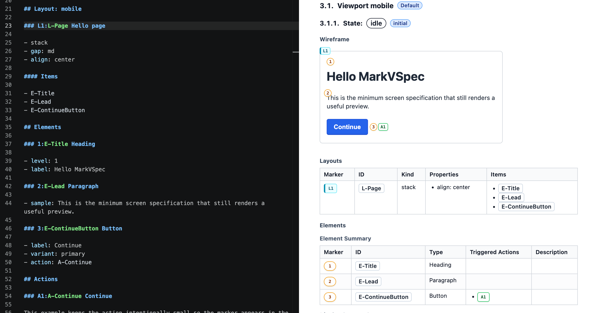

# MarkVSpec

<p>
  
</p>

MarkVSpec is a screen-specification tool for writing UI specs in Markdown,
previewing them in VS Code, and sharing them as HTML/PDF.

It is not a high-fidelity design tool like Figma. It is built for managing the
screens, states, interactions, and validation rules that implementation needs as
Git-friendly text. A `.vspec.md` file stays readable as a human design document
while also being structured enough for tools to interpret.

Because the source stays Markdown, teams can review diffs, let AI agents read
the spec, preview it in VS Code, validate it, and export it as HTML/PDF from the
same file.

日本語の説明は [README.ja.md](README.ja.md) を参照してください。

## Preview

This image shows the Markdown source from
[Hello Screen](examples/01-basics/hello-screen.vspec.md) next to the wireframe in
the generated static HTML preview. The same `.vspec.md` source can be opened in
VS Code preview, exported to HTML, and exported to PDF.



Open the MarkVSpec web introduction on GitHub Pages:
[MarkVSpec Website](https://wamukat.github.io/markvspec/).
Generated static HTML examples are available at
[MarkVSpec Examples](https://wamukat.github.io/markvspec/examples/).

## Why It Helps

- Keeps Markdown as the source of truth for screen specifications.
- Gives stable IDs to screens, layouts, elements, states, actions, and rules.
- Shows state-specific previews and generated design-document views while you
  write in VS Code.
- Lets reviews, implementation tasks, and generated output refer to the same
  screen parts by ID.
- Keeps the spec readable for both humans and AI agents.

MarkVSpec ships a VS Code extension and a CLI. The CLI command is `markvspec`.

## Good Fit

MarkVSpec is for teams that want to keep screen specifications in Markdown while
using the same source for review, implementation, and export.

- Manage screens, states, interactions, and validation rules in one document.
- Refer to screen parts from review comments and implementation tasks by stable
  ID.
- Preview while authoring in VS Code, then share HTML or PDF output.
- Ask AI to read the spec, explain diffs, or turn the screen design into
  implementation tasks.

MarkVSpec is not a visual design tool. It focuses on accurately managing screen
specs, states, interactions, and validation rules as text rather than polishing
pixel-level UI design.

It is not a good fit for:

- Creating high-fidelity visual design.
- Replacing Figma for pixel-level layout work.
- Making implementation component boundaries the main design-document concern.

## Quick Start

The shortest path is to install MarkVSpec from the VS Code Marketplace, create a
`.vspec.md` file, and open the Preview. CLI details are covered later.

### 1. Install from Marketplace

Install
[MarkVSpec from VS Code Marketplace](https://marketplace.visualstudio.com/items?itemName=wamukat.markvspec)
in VS Code.

```sh
code --install-extension wamukat.markvspec
```

### 2. Create `login.vspec.md`

Paste this minimal screen. It keeps states, screen elements, an action, and
validation in one Markdown file.

```markdown
---
id: SCR-LOGIN
type: screen
title: Login
route: /login
---

# SCR-LOGIN Login

## States

- idle*
- wait-auth

## Layout: mobile

### L1:L-Page Page

- stack
- align: center
- gap: md

#### Items

- E-PageTitle
- L-MessageArea
- E-EmailInput
- E-SignInButton

### L2:L-MessageArea Message area

- stack

## Elements

### 1:E-PageTitle Heading

- level: 1
- value: Sign in

### 2:E-EmailInput Input

- initial value: "test@example.com"
- input rule:
  - type: email

### 3:E-SignInButton Button

- label: Sign in
- variant: primary
- action: A-SubmitLogin

### 4:E-SendErrorBanner Banner

- value: Could not send the login request.
- tone: danger

## Form Groups

### F-LoginForm Login form

- fields:
  - E-EmailInput
- submit: A-SubmitLogin

## Actions

### A1:A-SubmitLogin Submit login

- From
  - idle
- Process P1: Validate login form
  - receive:
    - validation: V-EmailRequired.result
  - case: invalid
    - Effects
      - display:
        - target: E-EmailInput.error
        - message: V-EmailRequired.messages
    - stop
  - case: valid
    - continue
- Process P2: Send login request
  - request:
    - method: POST
    - path: /login
    - params:
      - email: E-EmailInput.value
  - case: sent
    - Effects
      - state: wait-auth
  - case: send-failed
    - Effects
      - state: idle
      - display:
        - target: L-MessageArea
        - element: E-SendErrorBanner

## Field Validations

### V1:V-EmailRequired Email required

- target: E-EmailInput
- constraints:
  - required:
    - message: Email is required.
```

For more realistic examples, browse the
[generated examples](https://wamukat.github.io/markvspec/examples/), or inspect
[Login Basic](examples/04-real-world-screens/login-basic.vspec.md) and the
[Example Gallery](docs/en/user/example-gallery.md) in the repository.

### 3. Open the Preview

Open the `.vspec.md` file in VS Code, then use one of these entry points:

- Run `MarkVSpec: Open Preview` from the Command Palette.
- Click the preview icon in the editor title.
- Right-click the file in Explorer and select `Open Preview`.

The preview shows the generated screen structure and state-specific design
document view.

## Install And Choose a Path

### Prerequisites

- VS Code 1.100.0 or later.
- Node.js 22 or later when using the CLI or building from source.
- The VS Code `code` command enabled when installing from the command line.

### Current Distribution Status

- VS Code extension: install `wamukat.markvspec` from
  [VS Code Marketplace](https://marketplace.visualstudio.com/items?itemName=wamukat.markvspec).
- CLI: use `npx` or install `@markvspec/cli` from npm.

Release maintainers must run `npm run check:readme-release` before tagging. The
check fails when README package versions or Marketplace links drift from the
release metadata.

### Choose a Path

| Goal | Start here |
| --- | --- |
| Fastest local preview | [Install from Marketplace](#1-install-from-marketplace), [Create `login.vspec.md`](#2-create-loginvspecmd), then [Open the Preview](#3-open-the-preview) |
| Understand the source / preview / generated document model | [HTML Authoring Guide](https://wamukat.github.io/markvspec/docs/en/user/authoring-guide.html) |
| Try real files after the guide | [Generated examples](https://wamukat.github.io/markvspec/examples/) and [repository sources](docs/en/user/example-gallery.md) |
| Look up exact syntax while writing | [Reference documents](#reference-documents) |
| Install the VS Code extension | [Install from Marketplace](#1-install-from-marketplace) |
| Validate or export from the CLI | [CLI](#cli) |
| Find examples by feature | [Examples](#examples) |

Recommended reading order for new users:

1. [HTML Authoring Guide](https://wamukat.github.io/markvspec/docs/en/user/authoring-guide.html): start with the visual HTML explanation of how MarkVSpec source becomes preview and generated-document structure.
2. [Generated examples](https://wamukat.github.io/markvspec/examples/): browse the HTML output, then open the linked `.vspec.md` source when you want to edit locally.
3. [Reference documents](#reference-documents): look up exact DSL, structured section, partial, and export rules only when needed.

## Common Tasks

For CLI commands, use `npx @markvspec/cli@latest` or install `@markvspec/cli`
from npm.

| Goal | Action |
| --- | --- |
| Preview while writing | Open a `.vspec.md` file in VS Code and run `MarkVSpec: Open Preview`. |
| Validate syntax | Run `npx @markvspec/cli@latest validate <file>`. |
| Share HTML | Use `MarkVSpec: Export Static HTML` or `npx @markvspec/cli@latest export html <file> --out <dir>`. |
| Create a PDF | Use `MarkVSpec: Export PDF` or `npx @markvspec/cli@latest export pdf <file> --out <dir>`. |
| Generate a document list | Run `npx @markvspec/cli@latest export document-list <project-file> --out <dir>`. |

## CLI

The CLI requires Node.js 22 or later.

### From npm

Run it against your local `login.vspec.md` file:

```sh
npx @markvspec/cli@latest validate login.vspec.md
npx @markvspec/cli@latest export html login.vspec.md --out markvspec-html
npx @markvspec/cli@latest export pdf login.vspec.md --out markvspec-pdf
npx @markvspec/cli@latest export document-list markvspec.project.md --out docs/generated
```

If you prefer a local install, add `@markvspec/cli` as a development dependency
and run it through your package manager.

## IDs and Markers

`E-EmailInput` and `A-SubmitLogin` are stable IDs used by reviews,
implementation tasks, generated documents, and tests. Prefixes such as `1:`,
`L1:`, and `A1:` are short visual markers for the preview. References still use
IDs, not markers.

```markdown
### L1:L-Page Page
### 1:E-PageTitle Heading
### A1:A-SubmitLogin Submit login
```

## Examples

The `examples/` directory is organized as a learning path. Use the generated
Pages index for browser previews, and use repository links when you want to edit
or review the source Markdown.

- Web examples: [Generated example index](https://wamukat.github.io/markvspec/examples/)
- Repository source: [examples/](examples/)
- Markdown guide: [English example gallery](docs/en/user/example-gallery.md)

Representative entry points:

- [Hello Screen preview](https://wamukat.github.io/markvspec/examples/hello-screen.html): minimum screen. ([source](examples/01-basics/hello-screen.vspec.md))
- [Single-field Validation preview](https://wamukat.github.io/markvspec/examples/single-field-validation.html): focused single-field validation contracts. ([source](examples/03-actions/single-field-validation.vspec.md))
- [Login Basic preview](https://wamukat.github.io/markvspec/examples/login-basic.html): form layout, validation feedback scenarios, and authentication progress. ([source](examples/04-real-world-screens/login-basic.vspec.md))
- [Profile Page With Template preview](https://wamukat.github.io/markvspec/examples/profile-page-with-template.html): template composition, route params, partial host metadata, and `display.partial` refresh. ([source](examples/05-reuse/profile-page-with-template.vspec.md))

## Reference Documents

Use these after the authoring guide or while editing a concrete file:

| Need | Reference |
| --- | --- |
| Exact DSL syntax | [DSL reference](docs/en/user/dsl.md) |
| Section ownership and prose rules | [Structured section reference](docs/en/user/structured-section-reference.md) |
| Server-rendered partial modeling | [Server-rendered partials](docs/en/user/server-partials.md) |
| HTML/PDF export constraints | [PDF export approach](docs/en/user/pdf-export.md) |
| Current limitations | [Known limitations](docs/en/user/limitations.md) |

## Troubleshooting

| Symptom | Check |
| --- | --- |
| `code` command is missing | In VS Code, run `Shell Command: Install 'code' command in PATH`. |
| VS Code extension install fails | Confirm that VS Code is 1.100.0 or later and that Marketplace extension ID `wamukat.markvspec` is available. |
| `npm install` or build fails | Confirm that Node.js 22 or later is active. |
| `npx @markvspec/cli@latest` cannot find the package | Confirm that your npm registry can resolve `@markvspec/cli`. |
| PDF export fails | Check [Known limitations](docs/en/user/limitations.md), then export static HTML if PDF output is blocked in your environment. |
| Preview does not open | Confirm that the file name ends with `.vspec.md` or `.vspec.project.md`. |
| ID-reference diagnostics appear | Check that `Items`, `action`, and `Events` entries refer to `E-*`, `L-*`, or `A-*` IDs, not markers. |

## Next Reading

| Goal | Document |
| --- | --- |
| Browse all English documentation | [English documentation index](docs/en/README.md) |
| Start from the HTML authoring path | [HTML Authoring Guide](https://wamukat.github.io/markvspec/docs/en/user/authoring-guide.html) |
| Browse practical examples | [Generated examples](https://wamukat.github.io/markvspec/examples/) and [Example gallery](docs/en/user/example-gallery.md) |
| Read the full syntax | [DSL reference](docs/en/user/dsl.md) |
| Understand PDF constraints | [PDF export approach](docs/en/user/pdf-export.md) |
| Check current limitations | [Known limitations](docs/en/user/limitations.md) |
| See release changes | [Changelog](CHANGELOG.md) |

## Development

```sh
npm run typecheck
npm test
npm run build
```

Internal design and release notes live under `docs/en/maintainers/` and
`docs/ja/maintainers/`.

MarkVSpec is screen-first. Componentization and implementation component
boundaries are treated as downstream implementation concerns, not primary
authoring concepts. Markdown remains the canonical source; tables and large YAML
blocks are avoided as the main editing surface.
