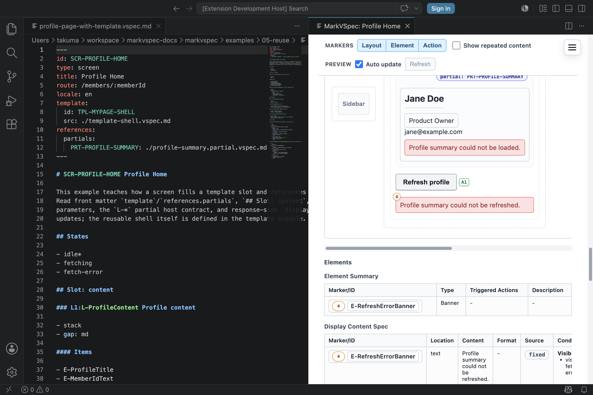

Partial updates describe server-rendered partials and htmx-style replacement as behavior, not raw attributes. In MarkVSpec, write the request and update semantics.

## Concept

A partial update changes part of the screen without navigating the whole page. In MarkVSpec, describe which request runs, which region changes, and whether the result is a message, an existing element, or a referenced partial. Avoid framework-specific HTML attributes in the source.

This keeps the UI specification reviewable whether the implementation uses Thymeleaf, htmx, a custom fetch flow, or another server-rendered approach. Preview can show the target layout group or message area, and HTML/PDF export can still explain the update intent.



## Minimal Example

```markdown
## Actions

### A-RefreshProfile Refresh profile

- Process P1: Request profile summary
  - request:
    - GET /profile/summary
  - case: success
    - display:
      - target: L-ProfileSummary
      - partial: PRT-PROFILE-SUMMARY
```

This example says that clicking a refresh button fetches a summary partial and replaces `L-ProfileSummary`. `partial: PRT-*` names the referenced partial document; it is not a raw library attribute.

## Common Patterns

- Put requests under `request:` inside `Process Pn:`.
- Put result-specific partial changes under process `case:` entries with `display`.
- Keep `target` and display payloads semantic.
- Use the ID of the updated layout group or message element as `target`.
- Use `partial: PRT-*` when the update uses a referenced partial document.
- Use `element: E-*` when the update shows an existing element.
- Use `message:` when the update shows message text or a message reference.
- Do not use raw HTML, CSS selectors, or htmx attributes as the payload.
- In failure cases, update a message area or state separately from the normal target.

## Example: Update Search Results

```markdown
## Layout: mobile

### L-SearchPanel Search Panel

- column

#### Items

- "Query": E-SearchInput
- "Results": L-ResultList
- "Status": E-SearchMessage

## Actions

### A-SearchProducts Search products

- Process P1: Search products
  - request:
    - GET /products/search
    - params:
      - q: E-SearchInput.value
  - case: sent
    - state: searching
  - case: success
    - state: results
    - display:
      - target: L-ResultList
      - partial: PRT-PRODUCT-RESULTS
  - case: empty
    - state: empty
    - display:
      - target: L-ResultList
      - element: E-EmptyResults
  - case: failure
    - state: error
    - display:
      - target: E-SearchMessage
      - message: Search error message
```

Search results, empty results, and errors are separate cases. Writing update targets by ID makes the relationship between layout, states, and actions easy to trace in both Git diffs and preview.

## Next Reading

- [Actions](/markvspec/en/guide/actions/)
- [Layout](/markvspec/en/guide/layout/)
- [Profile Home](/markvspec/examples/showcase/profile-page-with-template.html)
- [Profile Summary Partial](/markvspec/examples/showcase/profile-summary.partial.html)
- [Reference](/markvspec/en/reference/)
