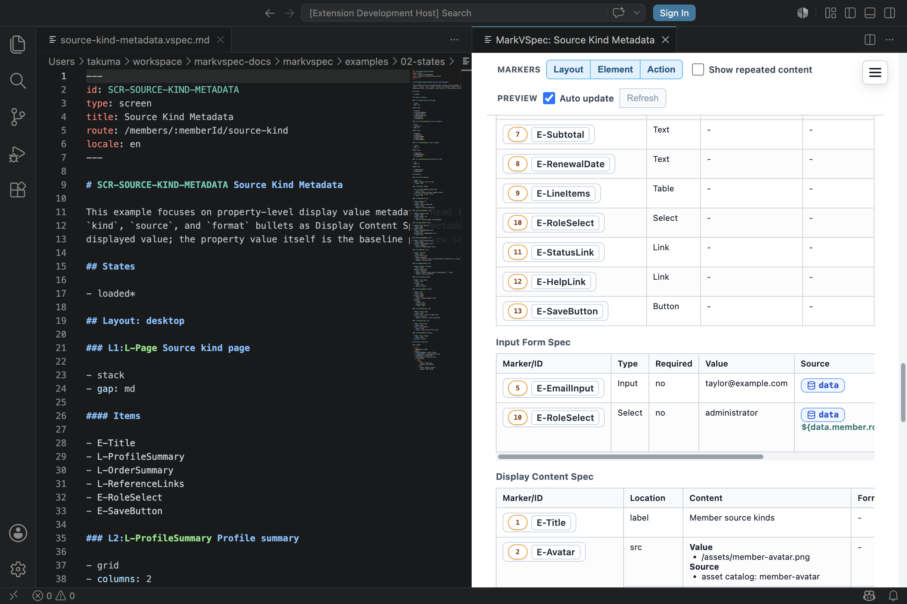

MarkVSpec is a text-first screen specification format. It is not a visual design tool or a replacement for implementation code.

## Syntax You Can Write

Write semantic DSL instead of implementation details.

```markdown
### E-Submit Button

- label: Submit
- variant: primary
- tone: neutral
- action: A-Submit
```

### What Not To Write

| Target | Reason | Write Instead |
| --- | --- | --- |
| Raw color | Depends on design tokens or implementation themes | Semantic intent such as `tone: danger` |
| CSS class | Implementation detail, not a stable specification contract | Element type, variant, and tone |
| Raw width/height/pixel values | Depends on layout implementation | Meaning such as `stack`, `row`, `gap`, and `align`. For input width, use `width: short`, `medium`, `long`, or `full` |
| JSON source | Not the authoring format | Markdown headings and bullets |
| Markdown table as source | Not the canonical parsed structure | Headings, bullets, and subsections |
| Component implementation | The primary model is screen-first | Screens, layout groups, elements, and actions |

## Small Example

Avoid:

```markdown
### E-Submit Button

- class: btn btn-blue w-240
- color: #0066ff
- width: 240px
```

Prefer:

```markdown
### E-Submit Button

- label: Submit
- variant: primary
- action: A-Submit
```



## Notes

- MarkVSpec is suited to low-fidelity wireframes and specification review.
- Pixel-perfect visual design belongs in a design system or UI implementation.
- JSON may exist as parser/export internals, but users should not write JSON as source.
- Markdown tables can explain content, but should not be canonical source for elements, actions, or rules.
- Componentization is an implementation concern. MarkVSpec's primary authoring model is screen-first.

## Related Pages

- [File Format](/markvspec/en/reference/file-format/)
- [Elements](/markvspec/en/reference/elements/)
- [Actions](/markvspec/en/reference/actions/)
- [Guide](/markvspec/en/guide/)
