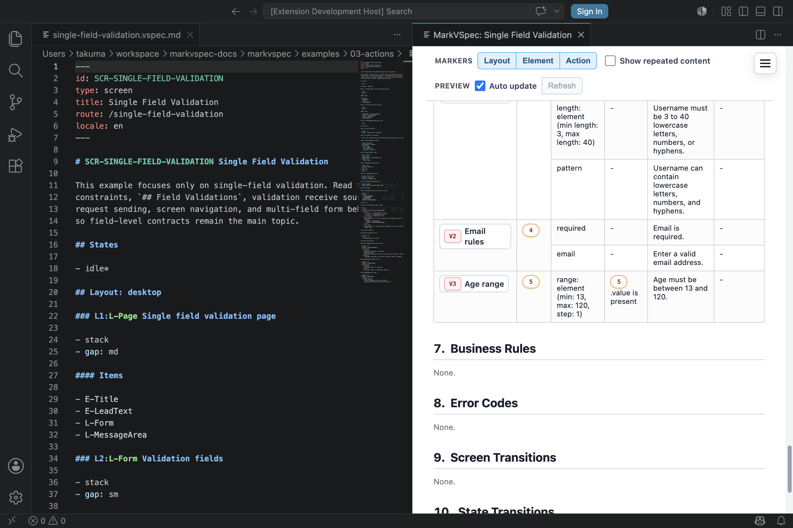

Validations cover validation contracts and error display. Put input metadata in `## Elements`, validation rules and messages in `## Field Validations`, and screen or business decisions in [Business Rules](/markvspec/en/reference/rules/).

## Boundary

| If the check is about... | Put it in |
| --- | --- |
| Required input metadata | The `Input` element `required` or `input rule` |
| Format, length, range, or pattern metadata | The `Input` element `input rule`, or `NumberInput` `min` / `max` / `step` |
| Validation rules and user-facing messages | `## Field Validations` |
| Comparing multiple fields | `## Cross-field Validations` |
| A client-side product rule | `## Business Rules` |
| A server response for one field | `## Actions` `case:` with `display` targeting the field error |
| A product decision such as permission, stock, or contract state | `## Business Rules`, then the server response `case:` |

## Syntax You Can Write

```markdown
## Elements

### E-EmailInput Input

- label: Email
- value: email
- type: email
- input rule:
  - type: email

## Field Validations

### V-EmailRules Email rules

- target: E-EmailInput
- constraints:
  - required:
    - message: Email is required.
  - email:
    - message: Enter a valid email address.
```

### Common Constraint Names

Write a rule name under `constraints`. The current implementation does not restrict rule names to a fixed list, but these names keep the source easy to match with input metadata and preview output.

| Constraint | Example | Use |
| --- | --- | --- |
| `required` | `- required:` | Do not allow an empty value |
| `email` | `- email:` | Email format |
| `length: element` | `- length: element` | Use `input rule` `min length` / `max length` metadata |
| `range: element` | `- range: element` | Use `NumberInput` `min` / `max` / `step` metadata |
| `pattern` | `- pattern:` | Domain-specific input format |

### Cross-field Validations

When a validation reads multiple fields, group those fields in `## Form Groups` and target that group from `## Cross-field Validations`.

```markdown
## Form Groups

### F-PasswordForm Password form

- fields:
  - E-PasswordInput
  - E-PasswordConfirmInput

## Cross-field Validations

### V-PasswordConfirmation Password confirmation

- target: F-PasswordForm
- inputs:
  - E-PasswordInput
  - E-PasswordConfirmInput
- check: E-PasswordInput.value equals E-PasswordConfirmInput.value
- message: Password and confirmation must match.
```

Do not write `scope`. The section name decides whether the validation is field-level or cross-field. Usually do not write `run`; the current implementation recognizes only `client`.

### Error Messages

Write error messages as `message` rows under each `## Field Validations` constraint.

```markdown
- constraints:
  - required:
    - message: Password is required.
  - length: element
    - message: Use at least 8 characters.
```

## Small Example

```markdown
### E-QuantityInput Input

- label: Quantity
- value: quantity
- input rule:
  - required

### E-AgeInput NumberInput

- label: Age
- min: 13
- max: 120

## Field Validations

### V-QuantityRules Quantity rules

- target: E-QuantityInput
- constraints:
  - required:
    - message: Quantity is required.

### V-AgeRange Age range

- target: E-AgeInput
- constraints:
  - range: element
    - message: Age must be between 13 and 120.
```



## Notes

- Element-level `constraints` and `error:` are not current MarkVSpec syntax.
- Write validation rules as `V-*` entries in `## Field Validations`.
- Cross-field validations target an `F-*` form group. Do not target an `L-*` layout for a composite validation.
- `## Business Rules` covers business rules and screen-specific conditions.
- Validator diagnostics are tool output, separate from validation requirements written in the source.
- Error display elements can be written in `## Elements` as `Paragraph` or `Text` with `tone: danger`.
- Server response errors are clearest when written in `## Actions` with `case:` and `display`.
- Use `display` `message` for user-visible error text. Use `element` or `partial` when the result shows an existing element or partial.

## Related Pages

- [Guide: Validation](/markvspec/en/guide/validation/)
- [Elements](/markvspec/en/reference/elements/)
- [Actions](/markvspec/en/reference/actions/)
- [Business Rules](/markvspec/en/reference/rules/)
- [Single Field Validation](/markvspec/examples/showcase/single-field-validation.html)
- [Login](/markvspec/examples/showcase/login-basic.html)
