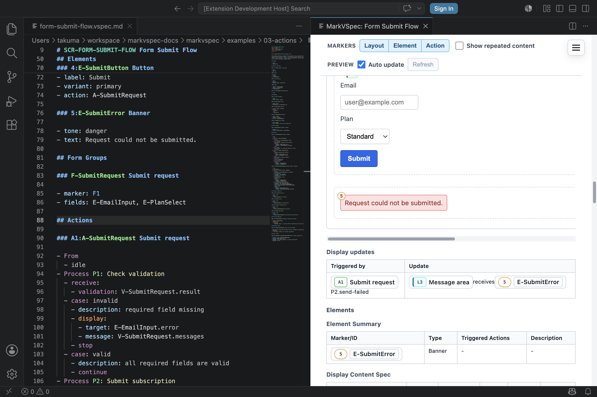

Action は「操作したら何が起きるか」を書く場所です。

ボタンやリンクには `action: A-*` を付けます。`## Actions` には、そのアクションが状態を変えるのか、リクエストを送るのか、別画面へ移るのかを書きます。

## まずこれだけ

以下は要素と `## Actions` の抜粋です。完全な画面ファイルでは、`## States`、
`## Layout`、入力要素、バリデーション定義も同じ `.vspec.md` に置きます。

```markdown
### E-SubmitButton Button

- label: Submit
- action: A-SubmitRequest

## Actions

### A-SubmitRequest Submit request

- From
  - idle
- Process P1: Check validation
  - receive:
    - validation: V-SubmitRequest.result
  - case: invalid
    - display:
      - target: E-EmailInput.error
      - message: V-SubmitRequest.messages
    - stop
- Process P2: Submit subscription
  - case: sent
    - state: submitting
```

プレビューでは、`Submit` ボタンと `A-SubmitRequest` のつながり、バリデーションエラーの表示差し替え、`idle` から `submitting` への変化を確認できます。



## 書く判断

- ボタンからアクションを呼ぶ: 要素の `action: A-*`。
- 画面読み込みでアクションを呼ぶ: `## Events`。
- アクションが有効な状態を絞る: `From`。
- HTTP リクエストを書く: `Process Pn:` の `request:`。
- 結果で分岐する: `case:`。
- 表示を差し替える: `display`。
- 画面を移動する: `navigate`。

## よく使う形

以下はサーバー応答を受け取るアクションの抜粋です。`submitting` 状態、
`L-MessageArea`、`E-SubmitError` は同じ画面内で定義済みのものとして読んでください。

```markdown
### A-HandleSubmitResponse Handle submit response

- From
  - submitting
- Process P1: Handle server response
  - receive:
    - response: A-SubmitRequest.P2.response
  - case: success
    - navigate: SCR-THANK-YOU
  - case: failure
    - state: idle
    - display:
      - target: L-MessageArea
      - element: E-SubmitError
```

ここで重要なのは、実装関数名ではなく「ユーザーに見える結果」が読めることです。

`A-SubmitRequest.P1.invalid` や成功トーストのようなアクション結果を名前付きプレビューケース
として固定したい場合は、[シナリオ](/markvspec/ja/guide/scenarios/) を使います。

## 見る例

- [Form Submit Flow](/markvspec/examples/showcase/form-submit-flow.html)
- [Display Updates](/markvspec/examples/showcase/display-effects.html)
- [シナリオ](/markvspec/ja/guide/scenarios/)
- [アクションリファレンス](/markvspec/ja/reference/actions/)
