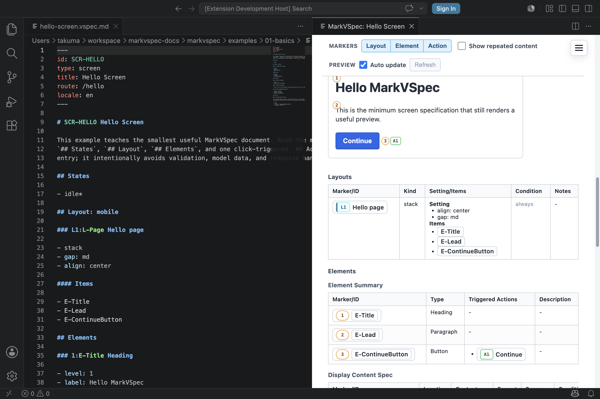

ID は対象を安定して参照するための名前です。表示ラベルや文言が変わっても、ID はできるだけ変えないようにします。

## 書ける構文

```markdown
---
id: SCR-LOGIN
type: screen
title: Login
---

## Layout: mobile

### L-LoginForm Login form

#### Items

- E-EmailInput
- E-SignInButton

## Elements

### 5:E-SignInButton Button

- label: Sign in
- action: A-SubmitLogin

## Actions

### A1:A-SubmitLogin Submit login
```

## 接頭辞

| 接頭辞 | 対象 | 例 |
| --- | --- | --- |
| `SCR-*` | 画面 | `SCR-LOGIN` |
| `L-*` | レイアウトグループ | `L-LoginForm` |
| `E-*` | 要素 | `E-EmailInput` |
| `A-*` | アクション | `A-SubmitLogin` |
| `R-*` | ルール | `R-CanSubmit` |

## マーカー付き見出し

対象見出しには、プレビュー用マーカーを ID の前に付けられます。

```markdown
### 5:E-SignInButton Button

### A1:A-SubmitLogin Submit login

### L1:L-LoginForm Login form
```

`:` より前がプレビューに表示されるマーカーです。安定した ID は `:` より後ろです。
`Items`、`action`、`target`、`navigate` などの参照では、マーカーではなく ID を使います。

プレビュー用マーカーが不要な場合は、省略できます。

```markdown
### E-SignInButton Button
```

## 小さな例

```markdown
### 1:E-RememberMe Checkbox

- label: Remember me

### A1:A-ToggleRememberMe Toggle remember me

- Process P1: Toggle remembered state
  - state: idle
```



## 注意点

- ID は参照用、`label` や `text` は表示用です。
- ID は大文字の接頭辞と意味のある名前で書きます。
- 同じファイル内で ID を重複させないでください。
- `Items`、`action`、`target`、`navigate` などはマーカーではなく ID を参照します。
- 画面を分割しても参照が壊れないよう、rename は慎重に行います。
- ID に生のルート、CSS class、データベース主キーを混ぜないでください。

## 関連ページ

- [ファイル形式](/markvspec/ja/reference/file-format/)
- [セクション](/markvspec/ja/reference/sections/)
- [要素](/markvspec/ja/reference/elements/)
- [アクション](/markvspec/ja/reference/actions/)
- [Hello Screen](/markvspec/examples/showcase/hello-screen.html)
