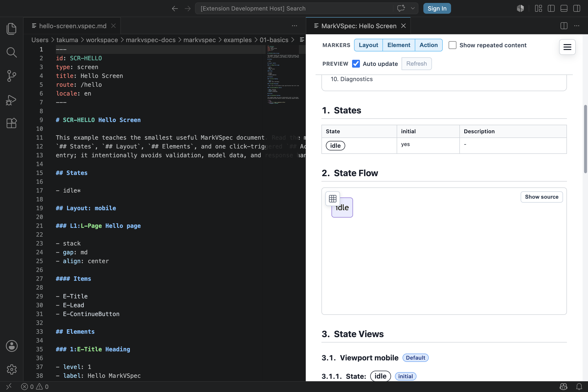

セクションは `.vspec.md` の本文を分割する最上位見出しです。MarkVSpec はセクション名から、後続の対象をどう読むかを判断します。

## 書ける構文

```markdown
## States

- idle*
- loading
- error

## Layout: mobile

### L-Page Page layout

- stack
- gap: md

#### Items

- E-Title
- E-Submit
```

### Layout と P-* パネル

意味のある領域は `L-*` で書きます。見た目だけを整える補助グループは `P-*` で書けます。

```markdown
### L-Form Form

- stack

#### Items

- P-NameFields
- E-SubmitButton

### P-NameFields Name fields

- row

#### Items

- E-FirstNameInput
- E-LastNameInput
```

`P-*` はレイアウト項目として使えますが、レイアウトマーカーを表示しません。
`marker` は無視され、`visible when` / `hidden when` / `disabled when` /
`enabled when` / `partial` / action や display の `target` には使えません。
対象にしたい領域は `L-*` にしてください。

レイアウト種別として認識される値は `stack`、`row`、`grid`、`inline` です。
縦に積む一般的なグループは `stack` を使います。

認識される最上位セクションは次の通りです。

| セクション | 書く内容 |
| --- | --- |
| `## States` | 画面状態の名前 |
| `## Layout: mobile` | レイアウトグループと項目の並び |
| `## Elements` | UI 要素の意味、ラベル、値、アクション |
| `## Actions` | トリガー、リクエスト、効果、ケース |
| `## Events` | page load など要素 click ではないイベント |
| `## Form Groups` | フォーム単位のフィールドグループと送信アクション |
| `## View Context` | 状態とは別に切り替わる表示文脈 |
| `## View Context Samples` | 表示文脈の代表値セット |
| `## Field Validations` | 単一フィールドの制約とメッセージ |
| `## Cross-field Validations` | 複数フィールドまたはフォーム単位のチェック |
| `## Validations` | 互換用の検証セクション。通常は `Field Validations` / `Cross-field Validations` を使う |
| `## Preview Scenarios` | 状態と Action の case 結果を組み合わせたプレビューケース |
| `## Business Rules` | ビジネスルールと画面固有の判断条件 |
| `## Error Codes` | 再利用するエラー定義と表示先 |
| `## Slots` | テンプレートが受け取る slot 宣言 |
| `## Slot: name` | ページ / partial から渡す slot 内容 |
| `## History Fields` | 履歴項目に使う構造化フィールド |
| `## History` | 変更履歴 |
| `## Notes` | 補足、実装メモ、意図 |
| `## Open Questions` | 未決事項 |

### States

state は `## States` の下に箇条書きで書きます。初期状態を明示したい場合は、
1つの状態にだけ `*` を付けます。

```markdown
## States

- idle*
- loading
- error
```

アクション分岐、要素の表示条件、プレビューメモからは同じ状態名を参照します。

### Form Groups

複数入力をまとめてバリデーション / 送信する場合は `## Form Groups` を使います。

```markdown
## Form Groups

### F-LoginForm Login form

- fields:
  - E-EmailInput
  - E-PasswordInput
- submit: A-SubmitLogin
```

ログイン、検索、プロフィール、設定フォームで使います。
[Login Basic](/markvspec/examples/showcase/login-basic.html) と
[Form Submit Flow](/markvspec/examples/showcase/form-submit-flow.html) を参照してください。

### Events

要素 click ではなくライフサイクルからアクションを呼ぶ場合は `## Events` を使います。

```markdown
## Events

- page.load: A-LoadPreferences
```

初期読み込み、partial 初期化、画面ライフサイクルによるデータ更新で使います。
[Parallel Initial Load](/markvspec/examples/showcase/parallel-initial-load.html) を参照してください。

### View Context

state を増やさずにタブ、選択中の行、開閉中のヘルプなどの表示文脈を切り替えたい場合は
`## View Context` と `## View Context Samples` を使います。

```markdown
## View Context

### selectedTab

- type: enum
- values:
  - profile*
  - billing

## View Context Samples

### billing-tab

- selectedTab: billing
```

`## Validations` は互換目的で認識されます。新しく書く場合は、単項目は
`## Field Validations`、複合項目は `## Cross-field Validations` を使います。

### Preview Scenarios

画面全体を複製せず、レビューしたいプレビュー状態に名前を付ける場合は
`## Preview Scenarios` を使います。

Preview Data は、MarkVSpec がプレビューや出力に渡す表示用データ全体の総称です。
要素の単一表示値、要素の `sample rows:`、Preview Scenario の
`samples:`、Preview Scenario の `route:`、`## View Context Samples` が含まれます。

```markdown
## Preview Scenarios

### idle-validation-error

- state: idle
- cases:
  - A-SubmitLogin.P1.invalid
- samples:
  - E-EmailInput: invalid@example
- route:
  - token: expired
```

エラー、空表示、ダイアログ、トースト、直接リンクの状態を見せたいときに使います。
`samples:` は要素ごとの Scenario Preview Data です。通常の要素には
`E-ElementId: value`、`Table` / `List` には `rows:` を使います。
空の繰り返し表示は `rows: []` と書きます。

```markdown
- samples:
  - E-Users:
    - rows:
      - row:
        - name: Alice
  - E-EmptyUsers:
    - rows: []
```

`route:` はルートパラメータやハッシュに使う Route Preview Data です。
ブロックで書き、`hash` 以外のキーは画面メタデータの `route:` にある `:param`
と対応させます。

`cases:` は `A-ActionId.P-marker.case-name` 形式で Action の処理結果を参照します。
`view:` は `## View Context Samples` の名前を参照します。`before:` は、このシナリオを
その前に表示したい状態名またはシナリオ名を参照します。`model:` は状態ビューのモデル名として保持されます。

シナリオ名が状態名と同じで `state:` を省略した場合、そのシナリオは追加ケースではなく
その状態の基準サンプルです。この場合に使えるのは `samples:` と `route:` だけです。

[Scenario Preview Data](/markvspec/examples/showcase/scenario-samples.html) と
[Display Effects](/markvspec/examples/showcase/display-effects.html) を参照してください。

### Field And Cross-Field Validations

1つの入力の制約は `## Field Validations`、複数入力またはフォームグループに
またがるチェックは `## Cross-field Validations` に書きます。

```markdown
## Field Validations

### V-EmailRules Email rules

- target: E-EmailInput
- constraints:
  - required:
    - message: Email is required.

## Cross-field Validations

### V-LoginForm Required login fields

- target: F-LoginForm
- inputs:
  - E-EmailInput
  - E-PasswordInput
- check: email and password are both present
```

[Single Field Validation](/markvspec/examples/showcase/single-field-validation.html) と
[Login Basic](/markvspec/examples/showcase/login-basic.html) を参照してください。

### Slots

テンプレート側で slot を宣言する場合は `## Slots`、ページ / partial 側で slot 内容を
渡す場合は `## Slot: name` を使います。

```markdown
## Slots

### content Main content

- required
- default: E-EmptySlotMessage

## Slot: content

### L-AccountContent Account content

#### Items

- E-Title
```

viewport ごとの slot 内容は `## Slot: name: viewport` と書きます。
[Profile Page With Template](/markvspec/examples/showcase/profile-page-with-template.html) と
[Responsive Slot Page](/markvspec/examples/showcase/responsive-slot-page.html) を参照してください。

### Error Codes

同じエラーに安定したコード、表示先、表示形式を持たせたい場合は `## Error Codes` を使います。
各エラーコードには `business rule`、`target`、`message`、`display` が必要です。
`display` は `inline`、`form`、`global`、`banner`、`toast`、`dialog`、`none`
を認識します。

```markdown
## Business Rules

### R-EmailMustBeUnique Email must be unique

- messages:
  - Email is already registered.

## Error Codes

### ER1:ERR-EMAIL-ALREADY-REGISTERED Email already registered

- business rule: R-EmailMustBeUnique
- target: E-SubmitError
- message: Email is already registered.
- display: banner
```

[Form Submit Flow](/markvspec/examples/showcase/form-submit-flow.html) を参照してください。

### History

履歴項目のフィールドを定義する場合は `## History Fields`、変更履歴は
`## History` に書きます。

```markdown
## History Fields

- date
  label: Date
  required: true

## History

### 0.1

- date: 2026-05-10
- author: Docs Team
- reason: Initial version.
```

レビュー履歴を仕様ファイルに残す場合に使います。
[History And Errors](/markvspec/examples/showcase/history-and-errors.html) を参照してください。

## 小さな例

```markdown
## Elements

### E-Message Paragraph

- text: Check your inbox.
- tone: info

## Open Questions

- Should the resend action be visible before 30 seconds?
```



## 注意点

- セクション見出しは英語の固定名を使います。日本語文書でも `## Elements` のように書きます。
- Markdown 見出しは対象の宣言です。見た目の見出し装飾ではありません。
- 対象は `### ID Name` またはマーカー付きの `### marker:ID Name` で宣言します。
- `#### Items` などのサブセクションは、直前の対象に属します。
- 未認識セクションは本文として扱われる可能性があり、プレビューやバリデーションの対象にならない場合があります。

## 関連ページ

- [ファイル形式](/markvspec/ja/reference/file-format/)
- [要素](/markvspec/ja/reference/elements/)
- [アクション](/markvspec/ja/reference/actions/)
- [ビジネスルール](/markvspec/ja/reference/rules/)
- [Hello Screen](/markvspec/examples/showcase/hello-screen.html)
