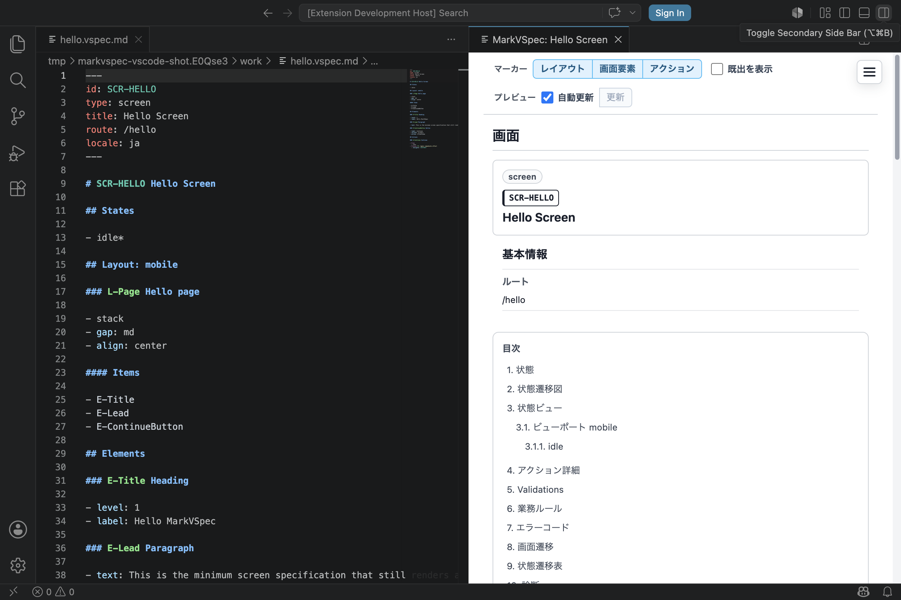

MarkVSpec を初めて使う人向けの最短ルートです。

リポジトリを clone していなくても進められる手順です。5分で、VS Code 拡張のインストール、最小画面ファイルの作成、ライブプレビュー、HTML / PDF 出力まで確認します。

## 5分で試す

### Step 1: 拡張を入れる

[MarkVSpec for VS Code](https://marketplace.visualstudio.com/items?itemName=wamukat.markvspec) を VS Code Marketplace から入れます。

CLI で入れる場合:

```bash
code --install-extension wamukat.markvspec
```

### Step 2: Hello Screen を作る

VS Code で空のフォルダーを開き、`hello.vspec.md` を作ります。次の内容を貼り付けて保存します。

```markdown
---
id: SCR-HELLO
type: screen
title: Hello Screen
route: /hello
locale: ja
---

# SCR-HELLO Hello Screen

## States

- idle*

## Layout: mobile

### L-Page Hello page

- stack
- gap: md
- align: center

#### Items

- E-Title
- E-Lead
- E-ContinueButton

## Elements

### E-Title Heading

- level: 1
- label: Hello MarkVSpec

### E-Lead Paragraph

- text: This is the minimum screen specification that still renders a useful preview.

### E-ContinueButton Button

- label: Continue
- variant: primary
- action: A-Continue

## Actions

### A-Continue Continue

- From
  - idle
- Process P1: Stay on the current screen
  - state: idle
```

### Step 3: プレビューを開く

コマンドパレットで次を実行します。

```text
MarkVSpec: Open Preview
```

ソースの右側にプレビューが開き、Markdown から生成された画面仕様を確認できます。



### Step 4: HTML / PDF を出力する

必要なら VS Code のコマンドパレットから HTML / PDF を出力します。

```text
MarkVSpec: Export Static HTML
MarkVSpec: Export PDF
```


CLI で出力したい場合は、同じファイルを指定します。詳しいオプションは [CLI](/markvspec/ja/reference/cli/) を参照してください。

```bash
npx @markvspec/cli@latest export html hello.vspec.md --out markvspec-html
npx @markvspec/cli@latest export pdf hello.vspec.md --out markvspec-pdf
```

## 詳細

- [最初の画面](/markvspec/ja/start/first-screen/): Hello Screen の読み方。
- [プレビュー](/markvspec/ja/start/preview/): VS Code ライブプレビューの開き方。
- [出力](/markvspec/ja/start/export/): HTML / PDF 出力の使い方。

最初は1画面につき1つの `.vspec.md` で始めます。複数の画面 / テンプレートをまとめて
確認したくなったら、後から `.vspec.project.md` を追加します。プロジェクトファイルは
[ファイル形式](/markvspec/ja/reference/file-format/) で説明しています。

## 次に読む

- [サンプル](/markvspec/ja/examples/): 追加で読める例。
- [ガイド](/markvspec/ja/guide/): MarkVSpec の基本。
- [リファレンス](/markvspec/ja/reference/): 記法の詳細。
