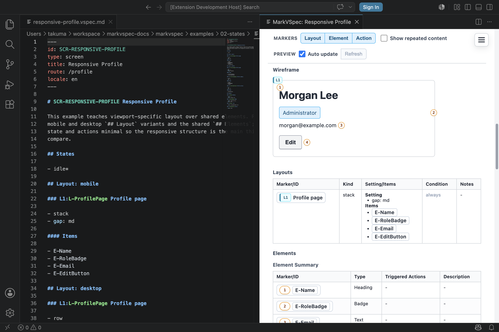

# Layout

Layout describes screen structure and order. Prefer meaningful groups, direction, gap, and items over low-level CSS details.

## Concept

The Layout section describes how the screen should be read as UI groups. Its purpose is not pixel-perfect placement. It gives preview, AI edits, and reviews a stable skeleton of the screen.

Use `L-*` layout groups for meaningful units such as forms, headers, lists, detail areas, and message areas. Use `stack` for vertical groups, `row` for horizontal groups, `grid` for grid-like groups, and `inline` for compact inline groups, then use `Items` to state which elements or subgroups belong inside the group.

## Minimal Example

```markdown
## Layout: mobile

### L-Form Login Form

- stack
- gap: sm

#### Items

- "Email": E-EmailInput
- "Password": E-PasswordInput
- "Submit": E-SignInButton
```

This example defines a login form as one layout group and fixes the order of the fields with `Items`. That is enough for preview to show what appears and in what order.



## Common Patterns

- Use `L-*` IDs for layout groups.
- Use `Items` to connect labels with element IDs.
- Do not write raw width, height, pixel values, or CSS class details.
- Write large screen regions first, such as `L-Page`, `L-Header`, `L-Main`, and `L-Aside`.
- If nesting becomes deep, keep only the groups that users would recognize as meaningful.
- Describe responsive behavior as layout intent, such as `mobile` or `desktop`, instead of CSS breakpoints.
- Do not place the same element in multiple groups. If it appears only in certain states, describe the state condition.

## P-* Presentation Panels

`P-*` is a presentation panel. Use it when the group is not a meaningful UI
region for reviewers, but only a visual arrangement helper, such as placing two
form fields on the same row.

```markdown
### L-ProfileForm Profile form

- stack

#### Items

- P-NameFields
- "Email": E-EmailInput

### P-NameFields Name fields

- row
- gap: sm

#### Items

- "First name": E-FirstNameInput
- "Last name": E-LastNameInput
```

Use `L-*` for meaningful layout groups that can be reviewed, marked, targeted,
hidden, or disabled. Use `P-*` only to arrange child items without adding layout
chrome or layout markers. When visibility, disabled state, partial replacement,
or action targeting matters, use an `L-*` layout instead.

See [Presentation Panel](../../../examples/showcase/presentation-panel.html)
for a small example where `P-NameFields` arranges two fields without adding a
visible panel marker.

## Example: Split Page Structure

```markdown
## Layout: mobile

### L-Page Settings Page

- stack
- gap: md

#### Items

- "Header": L-Header
- "Content": L-Content
- "Status": L-MessageArea

### L-Header Header

- row
- align: center

#### Items

- "Title": E-Title
- "Save": E-SaveButton

### L-Content Content

- stack
- gap: sm

#### Items

- "Name": E-NameInput
- "Email": E-EmailInput
```

Start from the large `L-Page`, then split the page into header, content, and message areas. This keeps the screen structure readable without committing to implementation class names or CSS grid details.

## Next Reading

- [Elements](elements.md)
- [States](states.md)
- [Responsive Profile](../../../examples/showcase/responsive-profile.html)
- [Reference](../reference/index.md)
