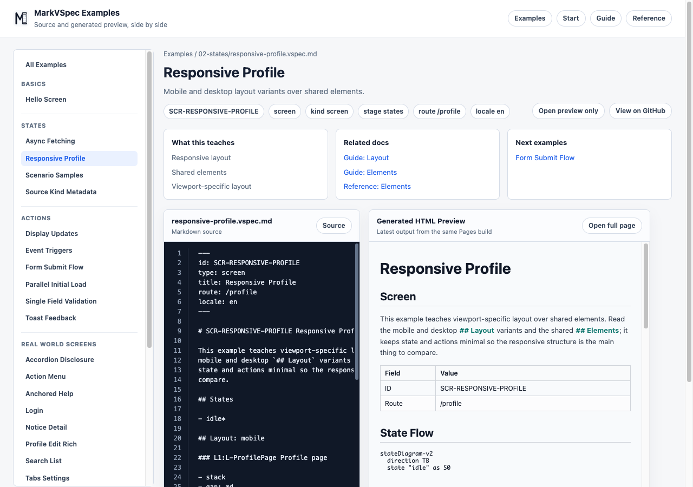

# Layout

Layout describes screen structure and order. Prefer meaningful groups, direction, gap, and items over low-level CSS details.

## Concept

The Layout section describes how the screen should be read as UI groups. Its purpose is not pixel-perfect placement. It gives preview, AI edits, and reviews a stable skeleton of the screen.

Use `L-*` layout groups for meaningful units such as forms, headers, lists, detail areas, and message areas. Use direction and spacing terms such as `column`, `row`, `stack`, `grid`, and `gap`, then use `Items` to state which elements or subgroups belong inside the group.

## Minimal Example

```markdown
## Layout: mobile

### L-Form Login Form

- column
- gap: sm

#### Items

- "Email": E-EmailInput
- "Password": E-PasswordInput
- "Submit": E-SignInButton
```

This example defines a login form as one layout group and fixes the order of the fields with `Items`. That is enough for preview to show what appears and in what order.



## Common Patterns

- Use `L-*` IDs for layout groups.
- Use `Items` to connect labels with element IDs.
- Do not write width, height, or CSS class details.
- Write large screen regions first, such as `L-Page`, `L-Header`, `L-Main`, and `L-Aside`.
- If nesting becomes deep, keep only the groups that users would recognize as meaningful.
- Describe responsive behavior as layout intent, such as `mobile` or `desktop`, instead of CSS breakpoints.
- Do not place the same element in multiple groups. If it appears only in certain states, describe the state condition.

## Example: Split Page Structure

```markdown
## Layout: mobile

### L-Page Settings Page

- column
- gap: md

#### Items

- "Header": L-Header
- "Content": L-Content
- "Status": L-MessageArea

### L-Header Header

- row
- align: center

#### Items

- "Title": E-Title
- "Save": E-SaveButton

### L-Content Content

- column
- gap: sm

#### Items

- "Name": E-NameInput
- "Email": E-EmailInput
```

Start from the large `L-Page`, then split the page into header, content, and message areas. This keeps the screen structure readable without committing to implementation class names or CSS grid details.

## Next Reading

- [Elements](elements.md)
- [States](states.md)
- [Responsive Profile](../../../examples/showcase/responsive-profile.html)
- [Reference](../reference/index.md)
