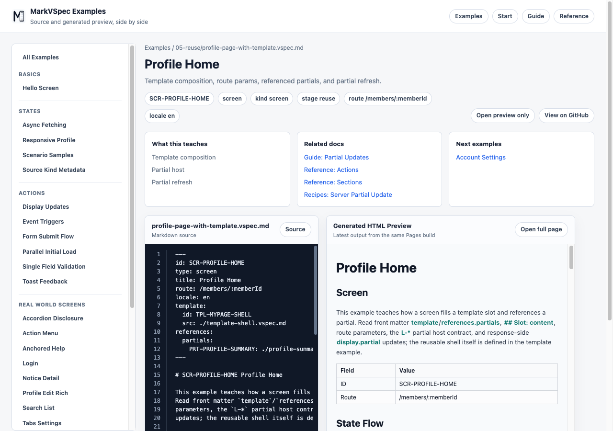

# Partial Updates

Partial updates describe server-rendered partials and htmx-style replacement as behavior, not raw attributes. In MarkVSpec, write the request and update semantics.

## Concept

A partial update changes part of the screen without navigating the whole page. In MarkVSpec, describe which request runs, which region changes, what content replaces it, and what update mode is intended. Avoid framework-specific HTML attributes in the source.

This keeps the UI specification reviewable whether the implementation uses Thymeleaf, htmx, a custom fetch flow, or another server-rendered approach. Preview can show the target layout group or message area, and HTML/PDF export can still explain the update intent.



## Minimal Example

```markdown
## Actions

### A-RefreshProfile Refresh profile

- Process P1: Request profile summary
  - server:
    - GET /profile/summary
  - case: success
    - display:
      - target: L-ProfileSummary
      - content: Profile summary partial
      - mode: replace
```

This example says that clicking a refresh button fetches a summary partial and replaces `L-ProfileSummary`. `mode: replace` means the target region is replaced; it is not a raw library attribute.

## Common Patterns

- Put requests under `server:` inside `Process Pn:`.
- Put result-specific partial changes under process `case:` entries with `display`.
- Keep `target` and `content` semantic.
- Use the ID of the updated layout group or message element as `target`.
- Describe the meaning of the partial in `content`; do not rely only on template paths or implementation details.
- Use `mode` for update intent such as `replace`. If append or prepend is needed, also describe the user-visible meaning.
- In failure cases, update a message area or state separately from the normal target.

## Example: Update Search Results

```markdown
## Layout: mobile

### L-SearchPanel Search Panel

- column

#### Items

- "Query": E-SearchInput
- "Results": L-ResultList
- "Status": E-SearchMessage

## Actions

### A-SearchProducts Search products

- Process P1: Search products
  - server:
    - GET /products/search
    - params:
      - q: E-SearchInput.value
  - case: sent
    - state: searching
  - case: success
    - state: results
    - display:
      - target: L-ResultList
      - content: Product result list partial
      - mode: replace
  - case: empty
    - state: empty
    - display:
      - target: L-ResultList
      - content: Empty result partial
      - mode: replace
  - case: failure
    - state: error
    - display:
      - target: E-SearchMessage
      - content: Search error message
```

Search results, empty results, and errors are separate cases. Writing update targets by ID makes the relationship between layout, states, and actions easy to trace in both Git diffs and preview.

## Next Reading

- [Actions](actions.md)
- [Layout](layout.md)
- [Profile Home](../../../examples/showcase/profile-page-with-template.html)
- [Profile Summary Partial](../../../examples/showcase/profile-summary.partial.html)
- [Reference](../reference/index.md)
