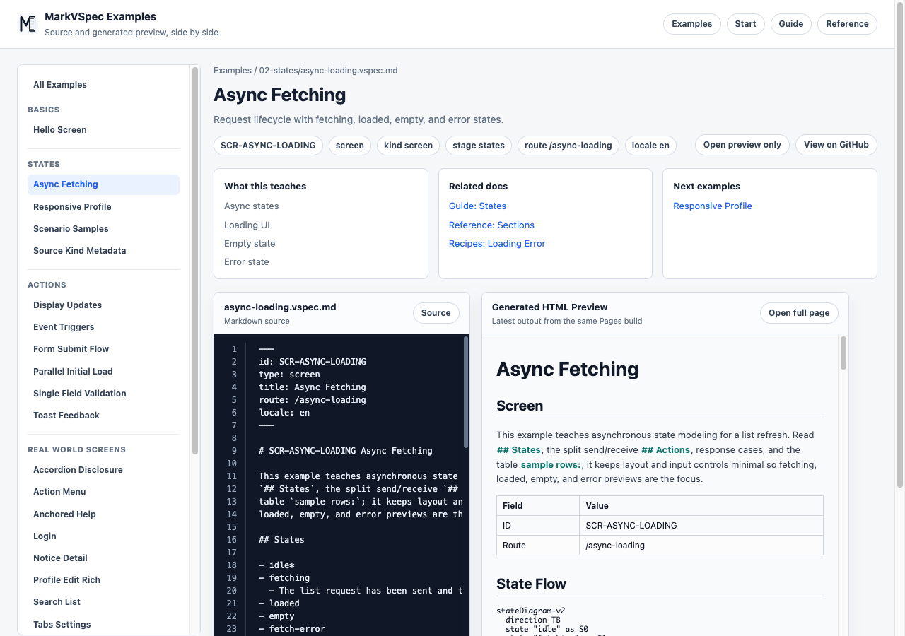

# States

States name the display modes a screen can be in. Use names such as loading, empty, error, and success so reviewers can see how the UI changes.

## Concept

A screen can be one screen while still having many display states. Initial, loading, input error, submitting, saved, and empty-result views should be named as states so reviews can stay clear about which version of the UI is being discussed.

Use state names from the user's point of view, not implementation booleans. Prefer `loading` over `isLoading`, and `auth-error` over `hasError`. Good state names are easy to reference from layout notes, elements, and action cases.

## Minimal Example

```markdown
## States

### idle

### loading

### error
```

This minimal example defines only the normal, loading, and error states. Even before you describe visual differences, these names can be used as action results and preview targets.



## Common Patterns

- Use short state names that are meaningful in the screen.
- Reference states from layout, elements, and action cases.
- For async work, align action cases with resulting states.
- Start with common names such as `idle`, `loading`, `empty`, `error`, and `success`, then specialize only when needed, such as `auth-error` or `permission-denied`.
- For in-flight API requests, use names such as `submitting` or `refreshing` so the user-facing wait state is clear.
- Avoid duplicating the whole screen for every state. Put state-specific differences near the layout, element, message, or action case that changes.

## Example: Connect Actions To States

```markdown
## Actions

### A-LoadOrders Load orders

- From
  - idle
- Process P1: Request orders
  - server:
    - GET /orders
  - case: sent
    - state: loading
  - case: success
    - state: success
  - case: empty
    - state: empty
  - case: failure
    - state: error
```

Write state changes under `case:` entries inside `Process Pn:`. This makes it easy to trace which operation creates each state in both preview and review.

## Next Reading

- [Layout](layout.md)
- [Actions](actions.md)
- [Async Fetching](../../../examples/showcase/async-loading.html)
- [Reference](../reference/index.md)
