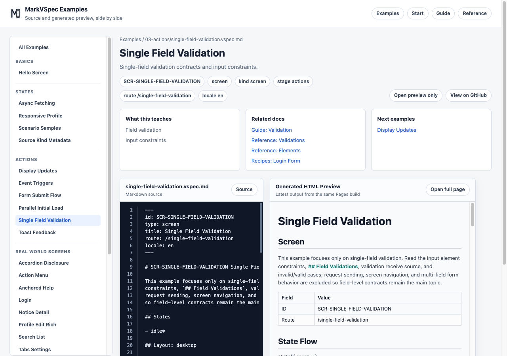

# Validation

Validation keeps input rules and error behavior in the source. Separating field constraints from action failure cases makes missing rules easier to spot.

## Concept

Validation separates constraints that belong to an input from errors that happen as a result of processing. Field constraints such as required, format, and minLength are easiest to read near the element. Business rules such as duplicate email, missing permission, or unavailable stock are easier to review as `R-*` rules or action cases because they connect to API and product behavior.

Errors should describe both the rule and the display behavior. Capture which state shows the error, which message area changes, and which tone the message uses. That keeps the same behavior visible in VS Code preview and exported HTML/PDF.



## Minimal Example

```markdown
## Elements

### E-EmailInput Input

- label: Email
- required
- constraints
  - format: email

## Business Rules

### R-EmailRequired Rule

- target: E-EmailInput
- message: Email is required
```

This example keeps basic field constraints on the element and separates the reviewable rule as `R-*`. For a small screen, you can start with the element alone. As fields and business rules grow, the `Business Rules` section keeps the source readable.

## Common Patterns

- Keep field constraints near the element.
- Split business rules into `R-*` rules.
- Use action failure cases to update error state or message areas.
- Write messages as user-facing copy, not only internal error codes.
- For rules involving multiple fields, explicitly name the affected fields.
- Use action cases to separate client-side validation from server-side validation after submit.
- Include error elements or message areas in layout so the display path is visible.

## Example: Server-side Validation

```markdown
## Elements

### E-NameInput Input

- label: Name
- required

### E-EmailInput Input

- label: Email
- required
- constraints
  - format: email

### E-FormMessage Message

- tone: danger
- visible when: input-error

## Business Rules

### R-UniqueEmail Rule

- target: E-EmailInput
- message: This email address is already used.

## Actions

### A-SubmitProfile Submit profile

- Process P1: Submit profile
  - server:
    - POST /profile
    - params:
      - name: E-NameInput.value
      - email: E-EmailInput.value
  - case: validation-error
    - state: input-error
    - display:
      - target: E-FormMessage
      - content: Validation error summary
```

Splitting field constraints, business rules, and post-submit error cases makes missing behavior easier to find. It also makes AI edits more precise because you can refer to IDs such as `R-UniqueEmail` or `A-SubmitProfile`.

## Next Reading

- [Elements](elements.md)
- [Actions](actions.md)
- [Single Field Validation](../../../examples/showcase/single-field-validation.html)
- [Login](../../../examples/showcase/login-basic.html)
- [Reference](../reference/index.md)
