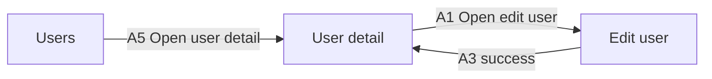

# Project Transition Diagrams

Project transition diagrams show navigation between MarkVSpec screen files. They
complement the existing per-screen state flow diagrams.

## Inputs

Project transition diagrams require:

- a project index or workspace discovery set
- parsed screen Front Matter for screen IDs, titles, routes, and owners
- parsed Action transitions with `navigate: SCR-*`
- optional action markers for compact labels

The diagram should ignore screen-local `state` transitions except when they
help label the edge. Screen-local state remains the responsibility of the
per-screen State Flow section.

## Extraction Rules

For each screen:

1. Parse the screen file with the existing core parser.
2. Find Action transitions where `to` starts with `SCR-`.
3. Create a project edge from the current screen ID to the target screen ID.
4. Attach metadata from the Action:
   - action ID
   - action marker
   - action name
   - source state
   - result case
5. Validate that the target screen exists in the project screen set.

External links such as `/users/new` or `https://...` should be collected as
external edges but not drawn as missing screens.

## Mermaid Output

Use `flowchart LR` for the first implementation. It reads better for
screen-to-screen navigation than `stateDiagram-v2`, which is already used for
screen-local state.

Node labels should prefer screen title, with screen ID available in a tooltip or
table. Edge labels should prefer marker plus action name when a marker exists.

## Design Document Output

A project design document should include:

- project summary
- screen inventory table
- transition diagram
- transition edge table
- diagnostics for missing screens, duplicate screen IDs, route collisions, and
  unresolved indexed files

## Implementation Surface

- Add a project parser for `vspec.project.md` Front Matter.
- Add a project loader that reads indexed or discovered screen files.
- Add a project validator for cross-file screen references.
- Add transition graph extraction in core or a new project package.
- Add VS Code command and static HTML export for project design documents.

These capabilities are part of the release surface for project transition
diagrams.
