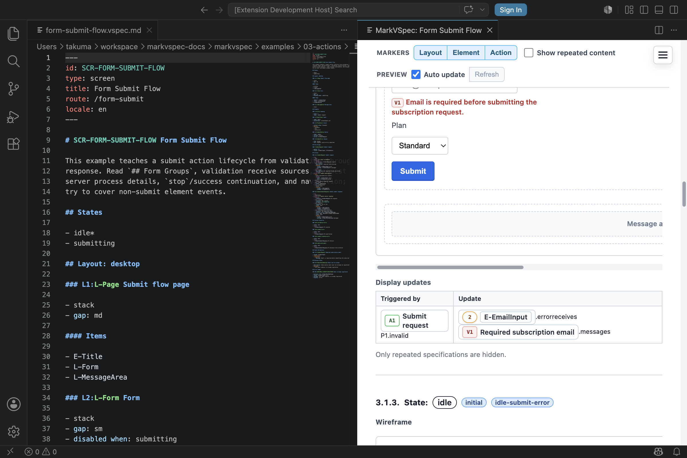

# Actions

`## Actions` connects user interaction, HTTP requests, state changes, navigation, and partial updates. Buttons and links refer to actions with `action: A-*`; lifecycle events such as page load are connected in `## Events`.

## Syntax You Can Write

This is an `## Actions` section snippet. The referenced states, layouts,
elements, validations, and messages are assumed to be defined in the same screen
document.

```markdown
## Actions

### A-SubmitLogin Submit login

- From
  - idle
- Process P1: Send login request
  - request:
    - POST /login
    - params:
      - email: E-EmailInput.value
      - password: E-PasswordInput.value
  - case: sent
    - state: wait-auth
  - case: send-failed
    - state: auth-error

### A-HandleLoginResponse Handle login response

- From
  - wait-auth
- Process P1: Apply login response
  - receive:
    - response: A-SubmitLogin.P1.response
  - case: success
    - from: wait-auth
    - response: 2xx authenticated user
    - navigate: SCR-DASHBOARD
  - case: failure
    - from: wait-auth
    - response: 401 invalid credentials
    - state: auth-error
    - display:
      - target: L-MessageArea
      - message: Authentication error message
```

### Action Heading

Declare an action with `### A-* Name`. When you want the preview to show an
action marker, write `### marker:A-* Name`.

These are heading snippets only.

```markdown
### A-RefreshList Refresh list

### A1:A-RefreshList Refresh list
```

### Blocks

| Block | Use |
| --- | --- |
| `From` | State where the action is available |
| `Process Pn: ...` | Request, calculation, local process, or response handling |
| `request` / `receive` / `sync` / `server` | Process input or execution detail |
| `case: ...` | Result-specific behavior such as success, failure, or empty |

### HTTP Request

Put HTTP request details under `request:` inside `Process Pn:`, then write the method/path and request parameters. Use `server:` only when you need to describe a server-side service call that is not the HTTP request itself.

This is a `Process` snippet inside an action.

```markdown
- Process P1: Load profile
  - request:
    - GET /profile
    - params:
      - userId: route.userId
```

### Partial Update

Describe server-rendered partial updates with `display` inside a result case, not raw htmx attributes.

This is a `Process` snippet inside an action.

```markdown
- Process P1: Apply profile response
  - case: success
    - response: 200 profile partial
    - display:
      - target: L-ProfileSummary
      - partial: PRT-PROFILE-SUMMARY
```

Use `display` fields consistently:

- `target`: MarkVSpec layout or element ID to update.
- `message`: semantic message text or message reference.
- `element`: `E-*` ID when the update shows an existing element.
- `partial`: `PRT-*` document ID when the update replaces the target with a
  referenced partial file.

Do not write raw HTML, CSS selectors, or htmx attributes in `display`. Describe
the user-visible result with MarkVSpec IDs and semantic messages.

## Small Example

This is a single-action snippet. In an actual screen, also define the caller
element and any valid states.

```markdown
### A-OpenSettings Open settings

- Process P1: Navigate to settings
  - navigate: SCR-SETTINGS
```



## Notes

- Use the `A-*` prefix for action IDs.
- Element events such as click are connected with `action: A-*` on the element.
- Lifecycle events such as page load are written in `## Events`.
- State names should match names written in `## States`.
- `partial` describes a partial replacement; it is not an instruction to write `hx-*` attributes.
- Use `message`, `element`, or `partial` as the display payload.
- Request parameters are easiest to review when written as references to element values.
- Write result branches as `case:` entries under the relevant `Process Pn:`.

## Related Pages

- [Elements](./elements.md)
- [Business Rules](./rules.md)
- [Validations](./validations.md)
- [IDs](./ids.md)
- [Form Submit Flow](../../../examples/showcase/form-submit-flow.html)
