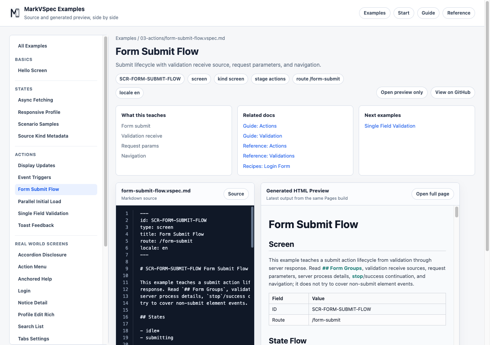

# Actions

`## Actions` connects user interaction, server requests, state changes, navigation, and partial updates. Buttons and links refer to actions with `action: A-*`; lifecycle events such as page load are connected in `## Events`.

## Syntax You Can Write

```markdown
## Actions

### A-SubmitLogin Submit login

- From
  - idle
- Process P1: Send login request
  - server:
    - POST /login
    - params:
      - email: E-EmailInput.value
      - password: E-PasswordInput.value
  - case: sent
    - state: wait-auth
  - case: send-failed
    - state: auth-error

### A-HandleLoginResponse Handle login response

- From
  - wait-auth
- Process P1: Apply login response
  - receive:
    - response: A-SubmitLogin.P1.response
  - case: success
    - from: wait-auth
    - response: 2xx authenticated user
    - navigate: SCR-DASHBOARD
  - case: failure
    - from: wait-auth
    - response: 401 invalid credentials
    - state: auth-error
    - display:
      - target: L-MessageArea
      - content: Authentication error message
      - mode: replace
```

### Action Heading

Declare an action with the `### A-* Name` form.

```markdown
### A-RefreshList Refresh list
```

### Blocks

| Block | Use |
| --- | --- |
| `From` | State where the action is available |
| `Process Pn: ...` | Request, calculation, local process, or response handling |
| `server` / `sync` / `receive` | Process input or execution detail |
| `case: ...` | Result-specific behavior such as success, failure, or empty |

### Server Request

Put request details under `server:` or `sync:` inside `Process Pn:`, then write the method/path and request parameters.

```markdown
- Process P1: Load profile
  - server:
    - GET /profile
    - params:
      - userId: route.userId
```

### Partial Update

Describe server-rendered partial updates with `display` inside a result case, not raw htmx attributes.

```markdown
- Process P1: Apply profile response
  - case: success
    - response: 200 profile partial
    - display:
      - target: L-ProfileSummary
      - content: Profile summary partial
      - mode: replace
```

## Small Example

```markdown
### A-OpenSettings Open settings

- Process P1: Navigate to settings
  - navigate: SCR-SETTINGS
```



## Notes

- Use the `A-*` prefix for action IDs.
- Element events such as click are connected with `action: A-*` on the element.
- Lifecycle events such as page load are written in `## Events`.
- State names should match names written in `## States`.
- `mode: replace` describes partial update semantics; it is not an instruction to write `hx-*` attributes.
- Request parameters are easiest to review when written as references to element values.
- Write result branches as `case:` entries under the relevant `Process Pn:`.

## Related Pages

- [Elements](elements.md)
- [Business Rules](rules.md)
- [Validations](validations.md)
- [IDs](ids.md)
- [Form Submit Flow](../../../examples/showcase/form-submit-flow.html)
