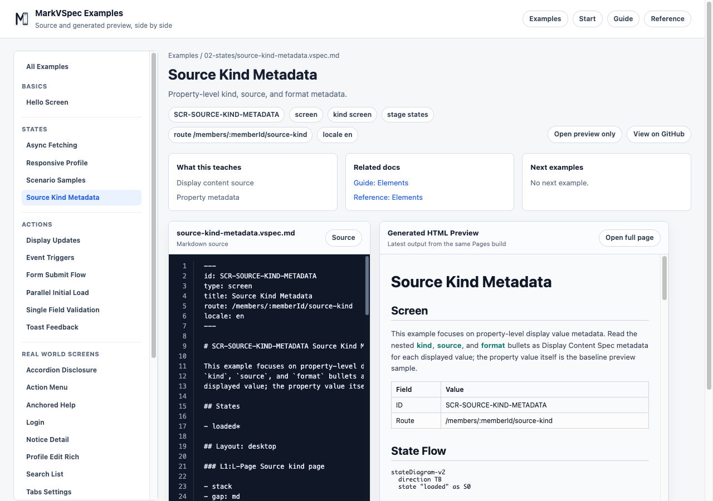

# Elements

`## Elements` describes UI elements by meaning. MarkVSpec records element type, label, text, value, variant, tone, and action instead of visual implementation details.

## Syntax You Can Write

```markdown
## Elements

### E-Title Heading

- level: 1
- text: Login

### E-EmailInput Input

- label: Email
- value: email
- required
- constraints
  - format: email

### E-SignInButton Button

- label: Sign in
- variant: primary
- action: A-SubmitLogin
```

### Element Heading

Declare an element with the `### E-* Name Type` form.

```markdown
### E-HelpText Paragraph
```

- `E-*` is the stable ID.
- `HelpText` is the human-readable object name.
- `Paragraph` is the element type.

### Common Types

| Type | Use |
| --- | --- |
| `Heading` | Screen or section headings. Always pair it with `level: 1..6`. |
| `Paragraph` | Descriptive prose and longer text. |
| `Text` | Short labels, values, and compact text. |
| `Input` | Text, email, password, search, and similar inputs. |
| `Button` | Controls that trigger actions. |
| `Link` | Navigation to another screen or external URL. |
| `Image` | Meaningful images or avatars. |
| `List` | Repeated items or menus. |

### Common Properties

| Property | Syntax | Use |
| --- | --- | --- |
| `label` | `- label: Sign in` | Control display name |
| `text` | `- text: Hello` | Prose or short display text |
| `value` | `- value: email` | Field value or data binding name |
| `placeholder` | `- placeholder: name@example.com` | Input example |
| `required` | `- required` | Required input |
| `variant` | `- variant: primary` | Priority: `primary`, `secondary`, `tertiary` |
| `tone` | `- tone: danger` | Semantic intent: `neutral`, `info`, `success`, `warning`, `danger` |
| `action` | `- action: A-SubmitLogin` | Action ID to trigger |

## Small Example

```markdown
## Elements

### E-ErrorMessage Paragraph

- text: Email or password is incorrect.
- tone: danger

### E-CreateAccount Link

- label: Create account
- href: /signup
```



## Notes

- Use `Heading` with `level: 1..6`, not `H1` or `H2` element types.
- `variant` means priority. It is not a color name.
- `tone` means semantic intent. It is not a raw color.
- Do not write CSS classes, width, height, pixel values, or raw colors in the primary DSL.
- Connect button behavior to `## Actions` with `action: A-*` instead of embedding behavior directly in the element.
- Use `Text` for compact display text and `Paragraph` for prose.

## Related Pages

- [Sections](sections.md)
- [Actions](actions.md)
- [Validations](validations.md)
- [IDs](ids.md)
- [Source Kind Metadata](../../../examples/showcase/source-kind-metadata.html)
