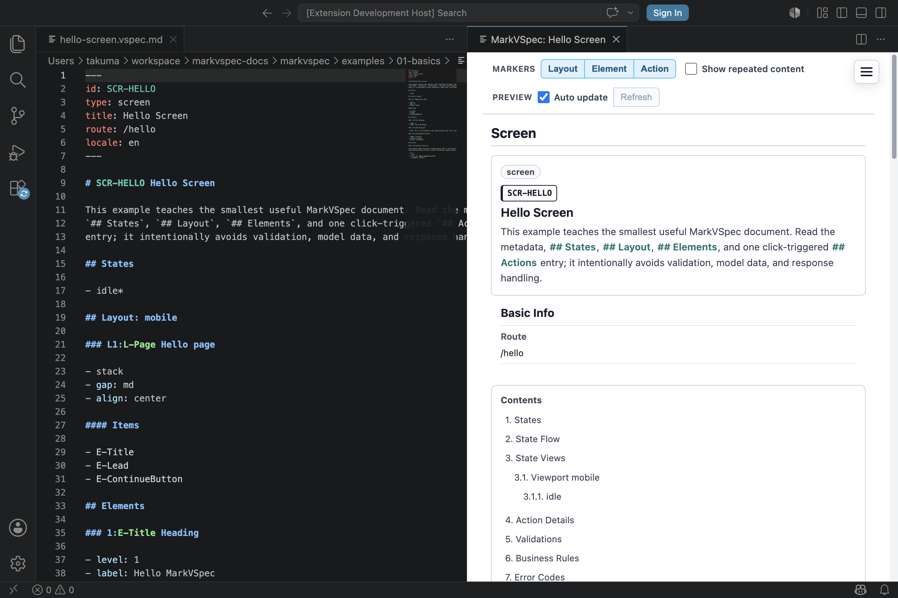

# File Format

A `.vspec.md` file is the MarkVSpec authoring source. One file normally describes one screen, template, or partial.
A `.vspec.project.md` file describes a project index that points to screen and template files.

## Syntax You Can Write

```markdown
---
id: SCR-LOGIN
type: screen
title: Login
route: /login
locale: en
---

## States

- idle*

## Layout: mobile

### L-Page Login page

- stack
- gap: md
```

### Front Matter

Front Matter contains document-level metadata only.

| Field | Required | Value |
| --- | --- | --- |
| `id` | yes | `SCR-*`, or a stable ID that matches the document type |
| `type` | yes | `screen`, `template`, `partial`, or `project` |
| `title` | yes | Human-readable screen name |
| `route` | no | URL path for a screen |
| `locale` | no | Locale such as `ja` or `en` |

Do not put element properties, actions, or layout items in Front Matter. Put them in the Markdown body.

### Project Files

Use a project file when you want one preview to list related screens and templates.

```markdown
---
id: PRJ-ACCOUNT
type: project
title: Account Project
screens:
  - id: SCR-LOGIN
    path: screens/login.vspec.md
templates:
  - id: TPL-ACCOUNT-SHELL
    path: templates/account-shell.vspec.md
---

# PRJ-ACCOUNT Account Project

Use this project to review the account screens together.

## Notes

Keep navigation and shared shell changes visible in one place.
```

Project preview renders the project lead and `## Notes` so reviewers can read the project intent beside the screen/template list and transition graph. Document-list export intentionally keeps the output compact and does not include long project lead / notes prose.

### Body

Write the body with Markdown headings and bullets.

- `##` is a top-level section.
- `###` declares an object.
- `####` declares a subsection inside an object.
- Bullets describe properties, rules, conditions, and transitions.
- A `###` object heading may be `### ID Name` or `### marker:ID Name`.

JSON is not the authoring format. Tools may use JSON internally or in exports, but users do not write JSON as the source format.

## Small Example

```markdown
---
id: SCR-HELLO
type: screen
title: Hello Screen
route: /hello
---

## Elements

### 1:E-Title Heading

- level: 1
- text: Hello MarkVSpec
```



## Notes

- Use the `.vspec.md` file extension.
- Split multi-screen specifications into multiple screen files.
- Front Matter is YAML, but the body should not drift into YAML or JSON.
- Markdown tables may be used for explanation, but they are not canonical source.
- Use `type: partial` for server-rendered partials or screen fragments.
- Use `type: project` only in `.vspec.project.md` files that list related screens and templates.
- Write states as bullets under `## States`; use `*` on one state for the initial state.

## Related Pages

- [Sections](sections.md)
- [IDs](ids.md)
- [Limitations](limitations.md)
- [Hello Screen](../../../examples/showcase/hello-screen.html)
