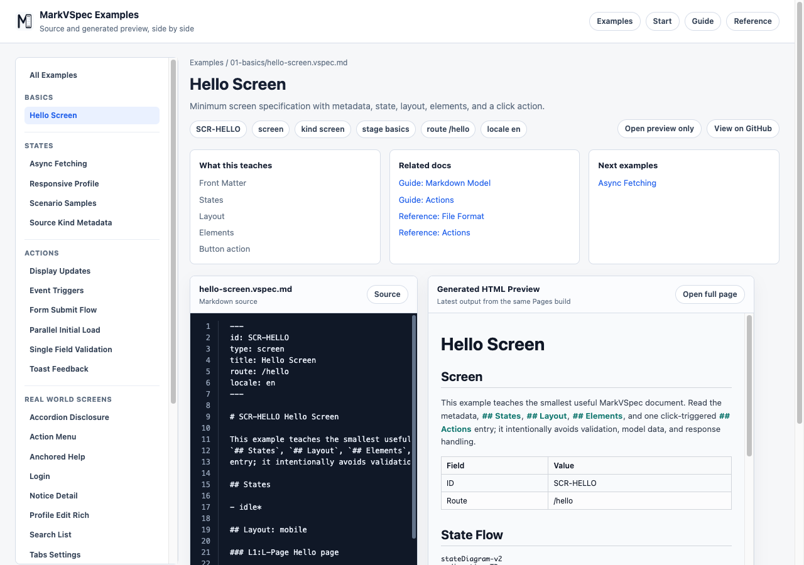

# IDs

IDs are stable names for referring to objects. Keep IDs stable when display labels or copy change.

## Syntax You Can Write

```markdown
---
id: SCR-LOGIN
type: screen
title: Login
---

## Layout: mobile

### L-LoginForm Login form

#### Items

- E-EmailInput
- E-SignInButton

## Elements

### E-SignInButton Button

- label: Sign in
- action: A-SubmitLogin

## Actions

### A-SubmitLogin Submit login
```

## Prefixes

| Prefix | Target | Example |
| --- | --- | --- |
| `SCR-*` | Screen | `SCR-LOGIN` |
| `L-*` | Layout group | `L-LoginForm` |
| `E-*` | Element | `E-EmailInput` |
| `A-*` | Action | `A-SubmitLogin` |
| `R-*` | Rule | `R-CanSubmit` |

## Small Example

```markdown
### E-RememberMe Checkbox

- label: Remember me

### A-ToggleRememberMe Toggle remember me

- Process P1: Toggle remembered state
  - state: idle
```



## Notes

- IDs are for references; `label` and `text` are for display.
- Write IDs with an uppercase prefix and a meaningful name.
- Do not duplicate IDs within the same file.
- `Items`, `action`, `target`, and `navigate` refer to IDs.
- Rename IDs carefully so references keep working when screens are split.
- Do not mix raw routes, CSS classes, or database primary keys into IDs.

## Related Pages

- [File Format](file-format.md)
- [Sections](sections.md)
- [Elements](elements.md)
- [Actions](actions.md)
- [Hello Screen](../../../examples/showcase/hello-screen.html)
