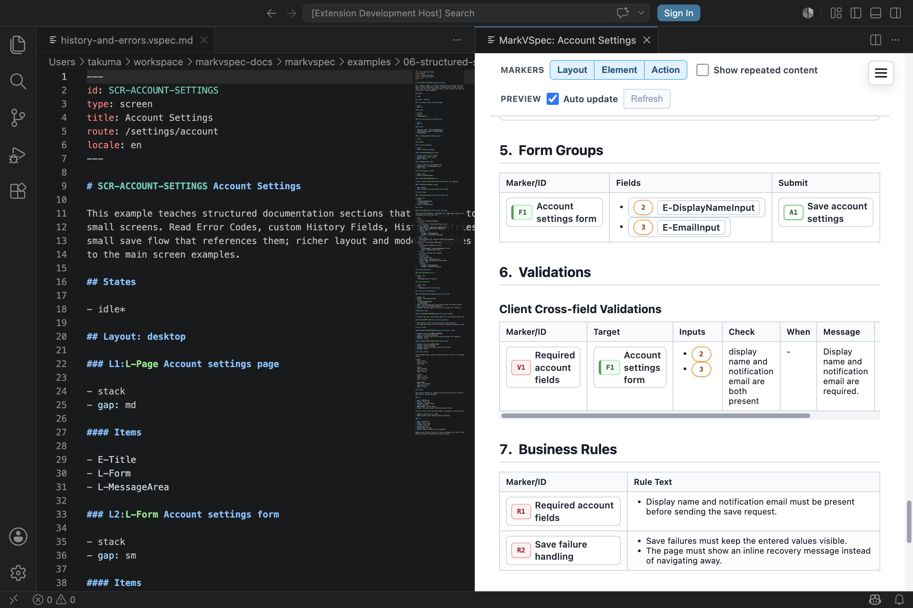

# Business Rules

`## Business Rules` describes business rules and screen-specific decisions. Keep it separate from input validation, tool diagnostics, and implementation-level if statements.

Use Business Rules when the decision depends on product meaning: permissions, account status, plan restrictions, stock, or a business decision that reads multiple values. Do not use this section for basic input shape such as required, format, min, max, or simple field comparison. Use [Validations](./validations.md) for those checks.

## Syntax You Can Write

```markdown markvspec-fragment section=business-rules
## Business Rules

### R-AccountLocked Locked account

- when: account.status is locked
- effect: disable E-SignInButton
- message: Account is locked.

### R-AccountRequiresMfa Account requires MFA

- when:
  - account.mfaRequired is true
  - device is not trusted
- effect: show E-MfaStep
- message: Additional verification is required.
```

### Rule Heading

Declare a rule with the `### R-* Name` form.

```markdown markvspec-fragment section=business-rules
### R-PasswordPolicy Password policy
```

### Common Properties

| Property | Use |
| --- | --- |
| `when` | Condition, written as one line or nested bullets |
| `effect` | Screen effect when the condition is true |
| `message` | Explanation or error shown to the user |
| `appliesTo` | Target element, layout, or action |
| `priority` | Priority when multiple rules may apply |

## Small Example

```markdown markvspec-skip reason=context
### R-EmptyResult Empty search result

- when: search returns no items
- effect: show E-EmptyMessage
- message: No matching results.
```



## Action Result Cases

When an action result is a business rule violation, put `business rule:` under
`case: business-rule-violation`. Other case names with `business rule:` are
reported as non-canonical.

```markdown markvspec-skip reason=context
## Actions

### A-Submit Submit

- Process P1: Submit request
  - case: business-rule-violation
    - business rule: R-EmailMustBeUnique
    - error code: ERR-EMAIL-ALREADY-REGISTERED
    - display:
      - target: E-EmailInput.error
      - message: R-EmailMustBeUnique.messages
```

## Difference From Validator Diagnostics

Validator Diagnostics are tool output from parser / validator checks. `## Business Rules` is author-written specification content for screen decisions.

## Notes

- Put required fields, formats, and ranges in [Validations](./validations.md).
- Put simple multi-field comparisons in [Validations](./validations.md) as `## Cross-field Validations`.
- Put server response errors in [Actions](./actions.md) response `case:` entries with `display`.
- Put request/response branches in `case:` entries under [Actions](./actions.md).
- `## Business Rules` is human-authored specification content. It is not where Validator Diagnostics are written.
- Use stable IDs such as `E-*` and `A-*` when a rule refers to elements or actions.
- Write conditions that matter to the screen specification, not CSS or implementation branches.

## Related Pages

- [Actions](./actions.md)
- [Validations](./validations.md)
- [IDs](./ids.md)
- [Limitations](./limitations.md)
- [Account Settings](../../../examples/showcase/history-and-errors.html)
