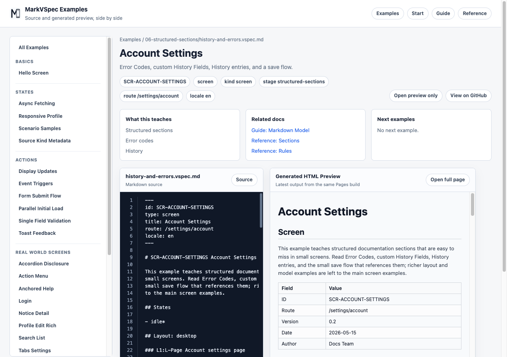

# Business Rules

`## Business Rules` describes business rules and screen-specific decisions. Keep it separate from input validation, tool diagnostics, and implementation-level if statements.

## Syntax You Can Write

```markdown
## Business Rules

### R-AccountLocked Locked account

- when: account.status is locked
- effect: disable E-SignInButton
- message: Account is locked.

### R-CanSubmit Can submit login

- when:
  - E-EmailInput.value is present
  - E-PasswordInput.value is present
- effect: enable E-SignInButton
```

### Rule Heading

Declare a rule with the `### R-* Name` form.

```markdown
### R-PasswordPolicy Password policy
```

### Common Properties

| Property | Use |
| --- | --- |
| `when` | Condition, written as one line or nested bullets |
| `effect` | Screen effect when the condition is true |
| `message` | Explanation or error shown to the user |
| `appliesTo` | Target element, layout, or action |
| `priority` | Priority when multiple rules may apply |

## Small Example

```markdown
### R-EmptyResult Empty search result

- when: search returns no items
- effect: show E-EmptyMessage
- message: No matching results.
```



## Difference From Validator Diagnostics

Validator Diagnostics are tool output from parser / validator checks. `## Business Rules` is author-written specification content for screen decisions.

## Notes

- Put required fields and formats in [Validations](validations.md).
- Put request/response branches in `case:` entries under [Actions](actions.md).
- `## Business Rules` is human-authored specification content. It is not where Validator Diagnostics are written.
- Use stable IDs such as `E-*` and `A-*` when a rule refers to elements or actions.
- Write conditions that matter to the screen specification, not CSS or implementation branches.

## Related Pages

- [Actions](actions.md)
- [Validations](validations.md)
- [IDs](ids.md)
- [Limitations](limitations.md)
- [Account Settings](../../../examples/showcase/history-and-errors.html)
