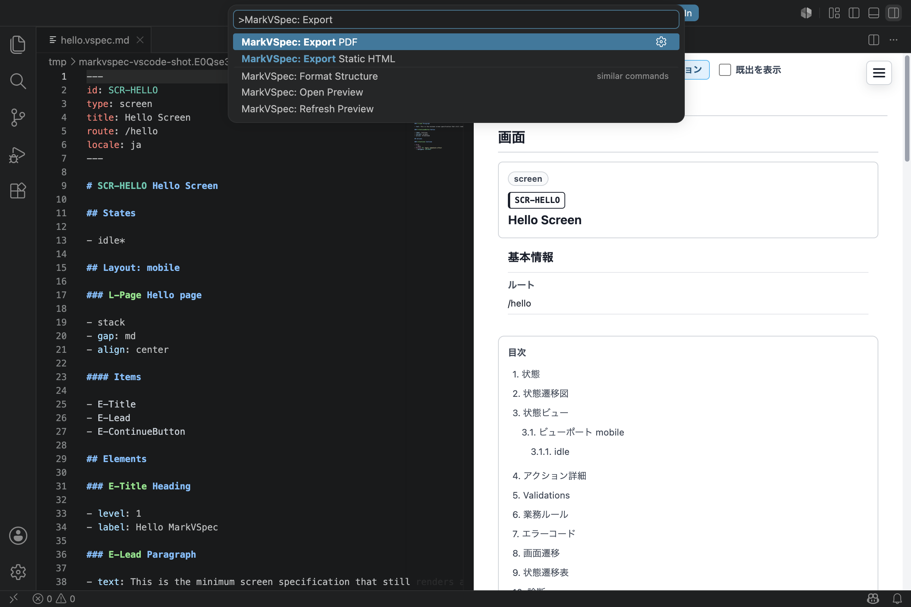

# Start

This is the shortest path for trying MarkVSpec for the first time.

You do not need to clone this repository. In about five minutes, you can install the VS Code extension, create a small screen file, open the live preview, and export HTML / PDF.

## Try It In 5 Minutes

### Step 1: Install The Extension

Install [MarkVSpec for VS Code](https://marketplace.visualstudio.com/items?itemName=wamukat.markvspec) from VS Code Marketplace.

Or install it from the command line:

```bash
code --install-extension wamukat.markvspec
```

### Step 2: Create Hello Screen

Open an empty folder in VS Code, create `hello.vspec.md`, paste this source, and save it.

```markdown
---
id: SCR-HELLO
type: screen
title: Hello Screen
route: /hello
locale: en
---

# SCR-HELLO Hello Screen

## States

- idle*

## Layout: mobile

### L-Page Hello page

- stack
- gap: md
- align: center

#### Items

- E-Title
- E-Lead
- E-ContinueButton

## Elements

### E-Title Heading

- level: 1
- label: Hello MarkVSpec

### E-Lead Paragraph

- text: This is the minimum screen specification that still renders a useful preview.

### E-ContinueButton Button

- label: Continue
- variant: primary
- action: A-Continue

## Actions

### A-Continue Continue

- From
  - idle
- Process P1: Apply immediate effect
  - navigate: SCR-NEXT
```

### Step 3: Open Preview

Run this from the Command Palette.

```text
MarkVSpec: Open Preview
```

The preview opens beside the source and shows the generated screen specification.


### Step 4: Export HTML / PDF

Export HTML / PDF from the VS Code Command Palette when you need shareable output.

```text
MarkVSpec: Export Static HTML
MarkVSpec: Export PDF
```



If you prefer the CLI, pass the same file.

```bash
npx @markvspec/cli@latest export html hello.vspec.md --out markvspec-html
npx @markvspec/cli@latest export pdf hello.vspec.md --out markvspec-pdf
```

## Details

- [First Screen](first-screen.md): Read Hello Screen.
- [Preview](preview.md): Open the VS Code live preview.
- [Export](export.md): Export HTML / PDF.

## Next

- [Examples](../examples/index.md): More examples to read after the first file.
- [Guide](../guide/index.md): MarkVSpec basics.
- [Reference](../reference/index.md): Syntax details.
