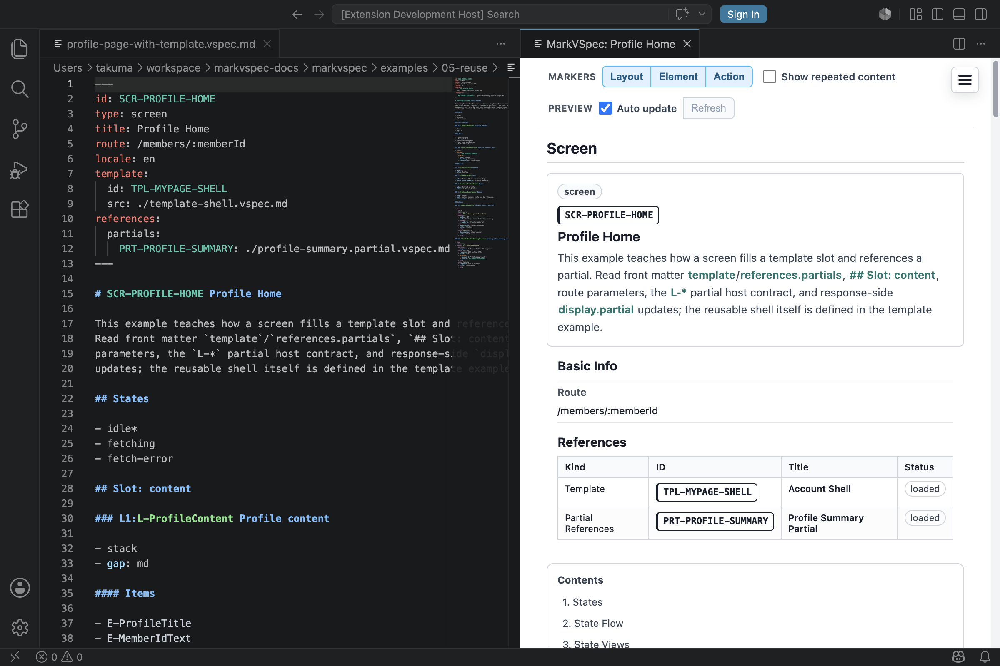

# 部分更新

部分更新は、画面全体ではなく一部だけを差し替える動きです。

MarkVSpec では `hx-*` や CSS selector は書きません。どのリクエストが、どの領域を、何に置き換えるかだけを書きます。

## まずこれだけ

以下は `## Actions` 内の抜粋です。完全な画面ファイルでは、更新対象の
`L-ProfileSummary` と、必要なボタンや状態も同じ `.vspec.md` に定義します。

```markdown
### A-RefreshProfile Refresh profile

- Process P1: Request profile summary
  - request:
    - GET /profile/summary
  - case: success
    - display:
      - target: L-ProfileSummary
      - partial: PRT-PROFILE-SUMMARY
```

プレビューでは、`L-ProfileSummary` が更新対象として読めます。



## 書くもの

- `request:`: 取得するリクエスト。
- `target`: 差し替えるレイアウト / 要素。
- `partial`: 参照する partial 文書で差し替える場合の `PRT-*` ID。
- `element`: 既存要素を表示する場合の `E-*` ID。
- `message`: メッセージ本文またはメッセージ参照。

## 書かないもの

- `hx-get`
- `hx-target`
- `hx-swap`
- CSS selector
- HTML 断片の中身そのもの

MarkVSpec は実装属性ではなく、画面仕様を書くためのものです。

## 見る例

- [Profile Home](../../../examples/showcase/profile-page-with-template.html)
- [Profile Summary Partial](../../../examples/showcase/profile-summary.partial.html)
- [サーバー部分更新](../recipes/server-partial-update.md)
