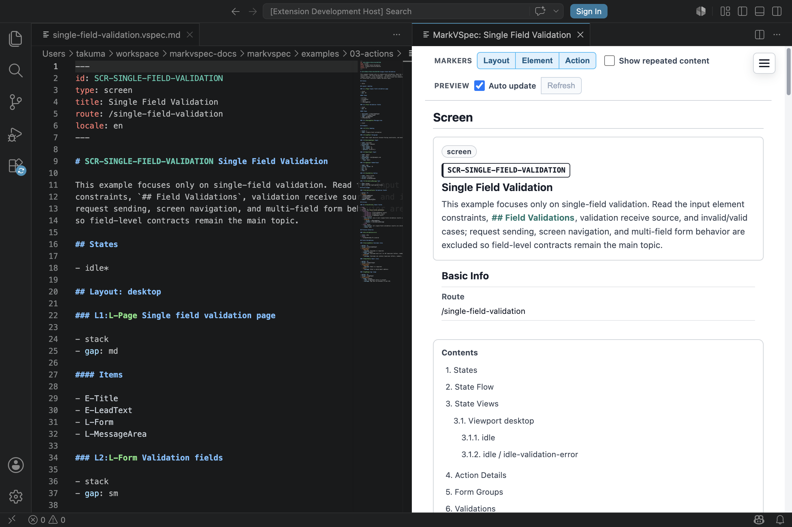

# Validation

Validation は「入力を受け付けてよいか」と「エラーをどう見せるか」を書くための章です。

まず、判定場所と対象を分けて考えます。

## 4つに分ける

| 種類 | 例 | 書く場所 |
| --- | --- | --- |
| クライアント単項目チェック | 必須、email形式、文字数、数値範囲 | `## Elements` の input |
| クライアント複合項目チェック | password確認、開始日 <= 終了日 | `## Business Rules` または submit前 action |
| サーバ単項目チェック | email重複、商品コード不存在 | `## Actions` の response case と対象 field |
| サーバ複合項目チェック | 在庫不足、権限不足、契約状態による不可 | `## Actions` の response case と `## Business Rules` |

Business Rule は、入力形式そのものではなく、画面や業務の判断条件を表します。

## クライアント単項目チェック

input 自体に閉じる条件は、element の近くに書きます。

```markdown
## Elements

### E-EmailInput Input

- label: Email
- required
- constraints
  - format: email
- error:
  - required: Email is required.
  - format: Enter a valid email address.
```

preview や review では、「この field には何を入力できるか」がその場で読めます。



## クライアント複合項目チェック

複数 field を見る条件は、単一 element に押し込まず、rule として分けます。

```markdown
## Business Rules

### R-PasswordMatches Password matches

- when:
  - E-PasswordInput.value is present
  - E-PasswordConfirmInput.value differs from E-PasswordInput.value
- appliesTo:
  - E-PasswordConfirmInput
- message: Password confirmation does not match.
```

「どの field を見て、どこへ表示するか」を明示すると、仕様レビューで validation の判断と表示位置を確認できます。

## サーバ単項目チェック

サーバに送って初めて分かる field error は、request の response case として書きます。

```markdown
## Elements

### E-EmailInput Input

- label: Email
- required
- constraints
  - format: email

### E-EmailError Text

- tone: danger
- visible when: input-error

## Actions

### A-SubmitProfile Submit profile

- Process P1: Submit profile
  - request:
    - POST /profile
    - params:
      - email: E-EmailInput.value
  - case: email-duplicated
    - state: input-error
    - display:
      - target: E-EmailError
      - message: This email address is already used.
```

これは `format: email` とは別物です。email の形式は client で見られますが、重複は server response で決まります。

## サーバ複合項目チェック

在庫、権限、契約状態、予約枠の空きなど、複数条件で決まるものは response case と business rule を対応させます。

```markdown
## Business Rules

### R-PlanAllowsExport Plan allows export

- when: current plan does not allow PDF export
- appliesTo: A-ExportPdf
- message: Your current plan cannot export PDF.

## Actions

### A-ExportPdf Export PDF

- Process P1: Request PDF export
  - request:
    - POST /exports/pdf
  - case: plan-not-allowed
    - state: export-error
    - display:
      - target: E-ExportMessage
      - message: Your current plan cannot export PDF.
```

Business Rule は「なぜ不可なのか」を説明し、Action case は「その結果、画面で何が起きるか」を書きます。

## エラー表示を書く

validation は判定だけでは不十分です。ユーザーに見える表示先も書きます。

- field の直下に出す: `E-EmailError`
- form 全体に出す: `E-FormMessage`
- action 結果として出す: `display` で target と message を指定する
- error state を持つ: `state: input-error` や `state: submit-error`

表示用 element は `tone: danger` の `Text` や `Paragraph` として `## Elements` に置きます。

## 迷ったとき

- 1つの field だけで判定できるなら `## Elements`。
- 複数 field や業務条件を見るなら `## Business Rules`。
- server response で決まるなら `## Actions` の `case:`。
- ユーザーに何を見せるかは `display` と error element で書く。

## 次に読むもの

- [Elements](elements.md)
- [Actions](actions.md)
- [Business Rules](../reference/rules.md)
- [Validation Reference](../reference/validations.md)
- [Single Field Validation](../../../examples/showcase/single-field-validation.html)
- [Login](../../../examples/showcase/login-basic.html)
