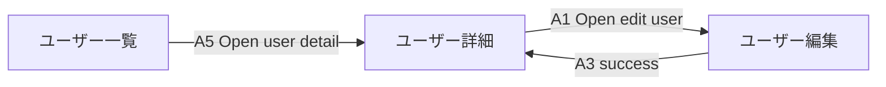

# プロジェクト遷移図

## この文書の位置づけ

この文書は、複数画面間の遷移図を生成するための将来設計です。画面内の状態や Action の
基本記法は [DSL リファレンス](../reference/index.md) を参照してください。

プロジェクト遷移図は、複数の MarkVSpec 画面ファイル間の画面遷移を表示します。
既存の画面内状態遷移図を補完するものです。

## 入力

プロジェクト遷移図には次が必要です。

- project index または workspace discovery set。
- screen ID、title、route を含む screen metadata。
- `navigate: SCR-*` を持つ Action transition。
- compact label 用の action marker。

screen-local な `state` transition は、edge label の補助に使う場合を除き diagram から
外します。screen-local state は、各 screen の State Flow section が担当します。

## 抽出ルール

各 screen について次を行います。

1. 既存 core parser で screen file を parse する。
2. `to` が `SCR-` で始まる Action transition を探す。
3. 現在の screen ID から target screen ID への project edge を作る。
4. Action から metadata を付ける。
   - action ID
   - action marker
   - action name
   - source state
   - result case
5. target screen が project screen set に存在するか validate する。

`/users/new` や `https://...` などの外部 link は external edge として集めますが、
missing screen としては扱いません。

## Mermaid 出力

初期実装では `flowchart LR` を使います。screen-local state には既に
`stateDiagram-v2` を使っているため、screen-to-screen navigation には flowchart の方が
読みやすいです。

node label は screen title を優先し、screen ID は tooltip または table で確認できるようにします。
edge label は marker があれば marker + action name を優先します。

## 設計書出力

project design document には次を表示します。

- project summary
- screen inventory table
- transition diagram
- transition edge table
- missing screen、duplicate screen ID、route collision、unresolved indexed file の diagnostics

## 将来実装候補

- `vspec.project.md` Front Matter 用の project parser を追加する。
- indexed / discovered screen files を読む project loader を追加する。
- cross-file screen references 用の project validator を追加する。
- core または新しい project package に transition graph extraction を追加する。
- VS Code command と static HTML export に project design document を追加する。

これらは project transition diagram を正式機能にする場合の実装候補です。現行リリースの利用手順ではありません。
